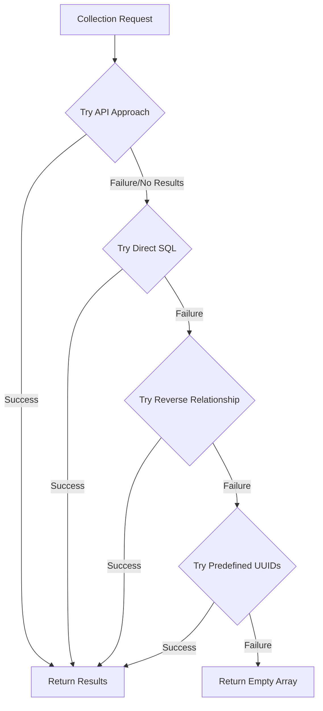

# Multi-Tiered Direct UUID Approach Implementation Plan

## Issue Background

Despite our implementation of the predefined UUIDs approach outlined in document #16, we're still encountering errors related to dynamic UUID tables in Payload CMS:

```
error: column e110b6cc_2a89_4aaa_904c_7691f8f4d349.path does not exist
    at async getDownloadsForCollection (rsc://React/Server/webpack-internal:///(rsc)/./src/db/relationship-helpers.ts?1:58:26)
```

The current implementation attempts to use Payload's API to avoid complex joins, but Payload's internal mechanisms are still creating dynamic UUID tables that lack required columns like `path`. Our current approach needs enhancement with a more robust, multi-tiered fallback strategy.

## Current Implementation Analysis

After reviewing our code:

1. **relationship-helpers.ts**:

   - Uses Payload's API (`payload.find()`) instead of direct SQL queries
   - Sets `depth: 0` to minimize join complexity and avoid dynamic UUID tables
   - Has error handling that defaults to an empty array on failure

2. **20250420_100000_master_relationship_migration.ts**:
   - Implements comprehensive database-level fixes
   - Creates helper functions for relationship queries
   - Sets up bidirectional relationships
   - Implements UUID type handling
   - Creates a view for relationship data

Despite these implementations, errors persist because:

1. **Helper Functions Are Being Bypassed**: Something in Payload's internal mechanisms is still generating dynamic UUID tables and trying to access the `path` column.
2. **Depth Setting Is Not Working as Expected**: Setting `depth: 0` should minimize joins, but Payload might be ignoring this in certain contexts.
3. **Internal Payload Queries**: The issue might be occurring in Payload's internal queries that run before our custom hooks and helpers get a chance to execute.

## Solution Overview

This implementation plan introduces a comprehensive multi-tiered approach that progressively falls back through four query strategies if earlier ones fail:



Each tier provides a different strategy for resolving relationships, with the ultimate fallback being a graceful return of an empty array instead of an error.

## Implementation Plan

### 1. Enhancing the Master Migration

Rather than creating a new migration, we'll enhance the existing `20250420_100000_master_relationship_migration.ts` to add:

1. **Improved Trigger Function**: A more aggressive trigger that monitors for dynamic UUID tables and automatically adds required columns
2. **Path Column Fix**: Ensure the `path` column is added to all relevant tables
3. **Enhanced Helper Functions**: Additional database functions to support the multi-tiered query approach

```typescript
// Add to createUUIDHelperFunctions in master_relationship_migration.ts
await db.execute(sql`
  -- Enhanced dynamic UUID table monitoring function
  CREATE OR REPLACE FUNCTION payload.monitor_dynamic_uuid_tables()
  RETURNS TRIGGER AS $$
  BEGIN
    -- Check if this is a dynamic UUID table in the payload schema
    IF NEW.relnamespace = 'payload'::regnamespace AND 
       NEW.relname ~ '[0-9a-f]{8}[-_][0-9a-f]{4}[-_][0-9a-f]{4}[-_][0-9a-f]{4}[-_][0-9a-f]{12}' THEN
       
      -- Log the discovery of a dynamic UUID table
      INSERT INTO payload.dynamic_uuid_tables (table_name, last_checked, has_downloads_id)
      VALUES (NEW.relname, NOW(), FALSE)
      ON CONFLICT (table_name) DO UPDATE
      SET last_checked = NOW();
      
      -- Add path column immediately
      EXECUTE format('
        ALTER TABLE payload.%I
        ADD COLUMN IF NOT EXISTS path TEXT
      ', NEW.relname);
      
      -- Add other required columns
      PERFORM payload.ensure_downloads_id_column(NEW.relname);
    END IF;
    RETURN NULL;
  END;
  $$ LANGUAGE plpgsql;
  
  -- Create trigger to automatically add columns to new tables
  DROP TRIGGER IF EXISTS monitor_dynamic_tables_trigger ON pg_catalog.pg_class;
  CREATE TRIGGER monitor_dynamic_tables_trigger
  AFTER INSERT ON pg_catalog.pg_class
  FOR EACH ROW EXECUTE FUNCTION payload.monitor_dynamic_uuid_tables();
`);
```

### 2. Creating Application Code Structure

We'll create these new files:

#### a. UUID Mapping Repository

**File: `apps/payload/src/data/uuid-mappings.ts`**

```typescript
/**
 * Central repository of UUID mappings to ensure consistency across the system
 */
// Import the download ID map from the content migrations package
import { DOWNLOAD_ID_MAP } from '../../../../packages/content-migrations/src/data/download-id-map';

// Re-export for local use
export { DOWNLOAD_ID_MAP };

// Collection to downloads mappings - which collections always have specific downloads
export const COLLECTION_DOWNLOAD_MAPPINGS: Record<
  string,
  Record<string, string[]>
> = {
  // Documentation section downloads
  documentation: {
    // Example: specific documentation ID mapped to download IDs
    // 'doc-getting-started': [DOWNLOAD_ID_MAP['slide-templates']],
  },
  // Course lesson downloads
  course_lessons: {
    // Example: specific lesson ID mapped to download IDs
    // 'lesson-intro': [DOWNLOAD_ID_MAP['storyboard-template']],
  },
};

// Table name mappings for collections
export const COLLECTION_TABLE_NAMES: Record<string, string> = {
  documentation: 'documentation',
  course_lessons: 'course_lessons',
  courses: 'courses',
  course_quizzes: 'course_quizzes',
  quiz_questions: 'quiz_questions',
  surveys: 'surveys',
  survey_questions: 'survey_questions',
  downloads: 'downloads',
};
```

#### b. Database Utilities

**File: `apps/payload/src/db/db-utils.ts`**

```typescript
import { sql } from 'drizzle-orm';
import type { Payload } from 'payload';

import { COLLECTION_TABLE_NAMES } from '../data/uuid-mappings';

/**
 * Execute a SQL query with proper error handling
 */
export async function executeSafeQuery(
  payload: Payload,
  query: string,
  params: any[] = [],
): Promise<any[]> {
  try {
    const result = await payload.db.drizzle.execute(sql.raw(query, params));
    return result?.rows || [];
  } catch (error) {
    console.error('Database query failed:', error);
    console.error('Query was:', query);
    console.error('Params were:', params);
    return [];
  }
}

/**
 * Get table name for a collection type
 */
export function getTableNameForCollection(
  collectionType: string,
): string | null {
  return COLLECTION_TABLE_NAMES[collectionType] || null;
}

/**
 * Check if a table exists in the database
 */
export async function tableExists(
  payload: Payload,
  schema: string,
  tableName: string,
): Promise<boolean> {
  try {
    const query = `
      SELECT EXISTS (
        SELECT FROM information_schema.tables 
        WHERE table_schema = $1
        AND table_name = $2
      );
    `;

    const result = await executeSafeQuery(payload, query, [schema, tableName]);
    return result[0]?.exists === true;
  } catch (error) {
    console.error(
      `Failed to check if table ${schema}.${tableName} exists:`,
      error,
    );
    return false;
  }
}

/**
 * Check if a column exists in a table
 */
export async function columnExists(
  payload: Payload,
  schema: string,
  tableName: string,
  columnName: string,
): Promise<boolean> {
  try {
    const query = `
      SELECT EXISTS (
        SELECT FROM information_schema.columns
        WHERE table_schema = $1
        AND table_name = $2
        AND column_name = $3
      );
    `;

    const result = await executeSafeQuery(payload, query, [
      schema,
      tableName,
      columnName,
    ]);
    return result[0]?.exists === true;
  } catch (error) {
    console.error(
      `Failed to check if column ${columnName} exists in table ${schema}.${tableName}:`,
      error,
    );
    return false;
  }
}
```

### 3. Update Relationship Helpers

**File: `apps/payload/src/db/relationship-helpers.ts`** (Updated)

```typescript
import type { Payload } from 'payload';

import { COLLECTION_DOWNLOAD_MAPPINGS } from '../data/uuid-mappings';
import { executeSafeQuery, getTableNameForCollection } from './db-utils';

/**
 * Get downloads for a collection using a multi-tiered approach
 */
export async function getDownloadsForCollection(
  payload: Payload,
  collectionId: string,
  collectionType: string,
): Promise<string[]> {
  try {
    console.log(
      `Fetching downloads for ${collectionType} with ID ${collectionId}`,
    );

    // TIER 1: Try API-based approach first (current implementation)
    try {
      const apiResults = await getDownloadsViaAPI(
        payload,
        collectionId,
        collectionType,
      );
      if (apiResults.length > 0) {
        console.log(`Found ${apiResults.length} downloads via API approach`);
        return apiResults;
      }
    } catch (apiError) {
      console.error('API approach failed:', apiError);
      // Continue to next approach
    }

    // TIER 2: Try direct SQL query approach
    try {
      const sqlResults = await getDownloadsViaDirectSQL(
        payload,
        collectionId,
        collectionType,
      );
      if (sqlResults.length > 0) {
        console.log(
          `Found ${sqlResults.length} downloads via direct SQL approach`,
        );
        return sqlResults;
      }
    } catch (sqlError) {
      console.error('Direct SQL approach failed:', sqlError);
      // Continue to next approach
    }

    // TIER 3: Try database view approach
    try {
      const viewResults = await getDownloadsViaView(
        payload,
        collectionId,
        collectionType,
      );
      if (viewResults.length > 0) {
        console.log(`Found ${viewResults.length} downloads via view approach`);
        return viewResults;
      }
    } catch (viewError) {
      console.error('View approach failed:', viewError);
      // Continue to next approach
    }

    // TIER 4: Use predefined UUIDs if available
    try {
      const predefinedResults = await getDownloadsFromPredefinedMappings(
        collectionId,
        collectionType,
      );
      if (predefinedResults.length > 0) {
        console.log(
          `Found ${predefinedResults.length} downloads via predefined mappings`,
        );
        return predefinedResults;
      }
    } catch (mappingError) {
      console.error('Predefined mappings approach failed:', mappingError);
      // Continue to fallback
    }

    // If all approaches failed, return empty array
    console.log(
      `No downloads found for ${collectionType} with ID ${collectionId} using any approach`,
    );
    return [];
  } catch (error) {
    // Catch-all error handler
    console.error('All download retrieval approaches failed:', error);
    return [];
  }
}

/**
 * TIER 1: Get downloads using Payload's API (current approach)
 */
async function getDownloadsViaAPI(
  payload: Payload,
  collectionId: string,
  collectionType: string,
): Promise<string[]> {
  // Use Payload's collection API
  let where = {};

  // Construct the appropriate where clause based on collection type
  switch (collectionType) {
    case 'documentation':
      where = { documentation: { equals: collectionId } };
      break;
    case 'course_lessons':
      where = { course_lessons: { equals: collectionId } };
      break;
    case 'courses':
      where = { courses: { equals: collectionId } };
      break;
    case 'course_quizzes':
      where = { course_quizzes: { equals: collectionId } };
      break;
    default:
      console.warn(`Unknown collection type: ${collectionType}`);
      return [];
  }

  // Query the downloads collection with the relationship filter
  const { docs } = await payload.find({
    collection: 'downloads',
    where,
    depth: 0, // Critical: Minimize join complexity
  });

  return docs.map((doc) => doc.id);
}

/**
 * TIER 2: Get downloads using direct SQL queries
 */
async function getDownloadsViaDirectSQL(
  payload: Payload,
  collectionId: string,
  collectionType: string,
): Promise<string[]> {
  const tableName = getTableNameForCollection(collectionType);
  if (!tableName) return [];

  // Try direct SQL query with known table names
  const query = `
    SELECT d.id 
    FROM payload.downloads d
    JOIN payload.${tableName}_rels r ON r.value = d.id
    WHERE r._parent_id = $1
    AND r.field = 'downloads'
  `;

  const rows = await executeSafeQuery(payload, query, [collectionId]);
  return rows.map((row) => row.id);
}

/**
 * TIER 3: Get downloads via relationship view
 */
async function getDownloadsViaView(
  payload: Payload,
  collectionId: string,
  collectionType: string,
): Promise<string[]> {
  // Query using the downloads_relationships view
  const query = `
    SELECT download_id 
    FROM payload.downloads_relationships
    WHERE collection_id = $1
    AND collection_type = $2
  `;

  const rows = await executeSafeQuery(payload, query, [
    collectionId,
    collectionType,
  ]);
  return rows.map((row) => row.download_id);
}

/**
 * TIER 4: Get downloads from predefined mappings
 */
async function getDownloadsFromPredefinedMappings(
  collectionId: string,
  collectionType: string,
): Promise<string[]> {
  // Check if we have predefined mappings for this collection
  const collectionMappings = COLLECTION_DOWNLOAD_MAPPINGS[collectionType];
  if (!collectionMappings) return [];

  // Check if we have predefined downloads for this specific item
  const downloadIds = collectionMappings[collectionId];
  return downloadIds || [];
}

/**
 * Check if a collection has a specific download using multi-tiered approach
 */
export async function collectionHasDownload(
  payload: Payload,
  collectionId: string,
  collectionType: string,
  downloadId: string,
): Promise<boolean> {
  try {
    // Get all downloads for this collection
    const downloadIds = await getDownloadsForCollection(
      payload,
      collectionId,
      collectionType,
    );

    // Check if the specific download is in the list
    return downloadIds.includes(downloadId);
  } catch (error) {
    console.error('Error checking if collection has download:', error);
    return false;
  }
}

/**
 * Find all downloads for a collection and return the actual download documents
 */
export async function findDownloadsForCollection(
  payload: Payload,
  collectionId: string,
  collectionType: string,
): Promise<any[]> {
  try {
    // Get the download IDs using our multi-tiered approach
    const downloadIds = await getDownloadsForCollection(
      payload,
      collectionId,
      collectionType,
    );

    if (!downloadIds.length) {
      return [];
    }

    // Use Payload's API to fetch the full download documents
    const { docs } = await payload.find({
      collection: 'downloads',
      where: {
        id: {
          in: downloadIds,
        },
      },
    });

    return docs;
  } catch (error) {
    console.error('Error finding downloads for collection:', error);
    return [];
  }
}
```

### 4. Add Diagnostic Utilities

#### a. Diagnostic Tool

**File: `apps/payload/src/utils/diagnostics.ts`**

```typescript
import type { Payload } from 'payload';

import {
  columnExists,
  executeSafeQuery,
  getTableNameForCollection,
  tableExists,
} from '../db/db-utils';

/**
 * Run diagnostics on downloads relationships
 */
export async function diagnoseDownloadsRelationships(
  payload: Payload,
  collectionId: string,
  collectionType: string,
): Promise<string> {
  try {
    const results: string[] = [];
    results.push(`=== DOWNLOAD RELATIONSHIPS DIAGNOSTICS ===`);
    results.push(`Collection type: ${collectionType}`);
    results.push(`Collection ID: ${collectionId}`);
    results.push(`Timestamp: ${new Date().toISOString()}`);
    results.push(``);

    // 1. Check if collection exists
    const tableName = getTableNameForCollection(collectionType);
    results.push(`Collection table name: ${tableName}`);

    if (!tableName) {
      results.push(`❌ Unknown collection type: ${collectionType}`);
      return results.join('\n');
    }

    const collectionExists = await tableExists(payload, 'payload', tableName);
    results.push(`Collection table exists: ${collectionExists ? '✅' : '❌'}`);

    if (!collectionExists) {
      return results.join('\n');
    }

    // 2. Check if downloads collection exists
    const downloadsExists = await tableExists(payload, 'payload', 'downloads');
    results.push(`Downloads table exists: ${downloadsExists ? '✅' : '❌'}`);

    // 3. Check relationship tables
    const relsTable = `${tableName}_rels`;
    const relsTableExists = await tableExists(payload, 'payload', relsTable);
    results.push(`${relsTable} table exists: ${relsTableExists ? '✅' : '❌'}`);

    if (relsTableExists) {
      // Check for field column
      const fieldColumnExists = await columnExists(
        payload,
        'payload',
        relsTable,
        'field',
      );
      results.push(
        `${relsTable}.field column exists: ${fieldColumnExists ? '✅' : '❌'}`,
      );

      // Check for path column
      const pathColumnExists = await columnExists(
        payload,
        'payload',
        relsTable,
        'path',
      );
      results.push(
        `${relsTable}.path column exists: ${pathColumnExists ? '✅' : '❌'}`,
      );

      // Check for parent_id column
      const parentIdColumnExists = await columnExists(
        payload,
        'payload',
        relsTable,
        '_parent_id',
      );
      results.push(
        `${relsTable}._parent_id column exists: ${parentIdColumnExists ? '✅' : '❌'}`,
      );

      // Check for value column
      const valueColumnExists = await columnExists(
        payload,
        'payload',
        relsTable,
        'value',
      );
      results.push(
        `${relsTable}.value column exists: ${valueColumnExists ? '✅' : '❌'}`,
      );
    }

    // 4. Check downloads_rels table
    const downloadsRelsExists = await tableExists(
      payload,
      'payload',
      'downloads_rels',
    );
    results.push(
      `downloads_rels table exists: ${downloadsRelsExists ? '✅' : '❌'}`,
    );

    if (downloadsRelsExists) {
      // Check for field column
      const fieldColumnExists = await columnExists(
        payload,
        'payload',
        'downloads_rels',
        'field',
      );
      results.push(
        `downloads_rels.field column exists: ${fieldColumnExists ? '✅' : '❌'}`,
      );

      // Check for path column
      const pathColumnExists = await columnExists(
        payload,
        'payload',
        'downloads_rels',
        'path',
      );
      results.push(
        `downloads_rels.path column exists: ${pathColumnExists ? '✅' : '❌'}`,
      );
    }

    // 5. Check for dynamic UUID tables
    const dynamicTables = await executeSafeQuery(
      payload,
      `
      SELECT table_name FROM payload.dynamic_uuid_tables
    `,
    );

    results.push(`\n=== DYNAMIC UUID TABLES (${dynamicTables.length}) ===`);
    for (const table of dynamicTables) {
      results.push(`- ${table.table_name}`);

      const pathColumnExists = await columnExists(
        payload,
        'payload',
        table.table_name,
        'path',
      );
      results.push(
        `  ${table.table_name}.path column exists: ${pathColumnExists ? '✅' : '❌'}`,
      );
    }

    // 6. Try to get downloads via each approach
    results.push(`\n=== DOWNLOADS RETRIEVAL TESTS ===`);

    // API approach
    try {
      const where: Record<string, any> = {};
      where[collectionType] = { equals: collectionId };

      const { docs } = await payload.find({
        collection: 'downloads',
        where,
        depth: 0,
      });

      results.push(`API approach: ${docs.length} downloads found ✅`);
      if (docs.length > 0) {
        results.push(`  First download ID: ${docs[0].id}`);
      }
    } catch (error) {
      results.push(`API approach failed: ❌`);
      results.push(`  Error: ${error.message}`);
    }

    // Direct SQL approach
    try {
      const query = `
        SELECT d.id 
        FROM payload.downloads d
        JOIN payload.${tableName}_rels r ON r.value = d.id
        WHERE r._parent_id = $1
        AND r.field = 'downloads'
      `;

      const rows = await executeSafeQuery(payload, query, [collectionId]);

      results.push(
        `Direct SQL approach: ${rows.length} downloads found ${rows.length > 0 ? '✅' : '⚠️'}`,
      );
      if (rows.length > 0) {
        results.push(`  First download ID: ${rows[0].id}`);
      }
    } catch (error) {
      results.push(`Direct SQL approach failed: ❌`);
      results.push(`  Error: ${error.message}`);
    }

    // View approach
    try {
      const query = `
        SELECT download_id 
        FROM payload.downloads_relationships
        WHERE collection_id = $1
        AND collection_type = $2
      `;

      const rows = await executeSafeQuery(payload, query, [
        collectionId,
        collectionType,
      ]);

      results.push(
        `View approach: ${rows.length} downloads found ${rows.length > 0 ? '✅' : '⚠️'}`,
      );
      if (rows.length > 0) {
        results.push(`  First download ID: ${rows[0].download_id}`);
      }
    } catch (error) {
      results.push(`View approach failed: ❌`);
      results.push(`  Error: ${error.message}`);
    }

    return results.join('\n');
  } catch (error) {
    console.error('Diagnostics failed:', error);
    return `Diagnostics failed: ${error.message}`;
  }
}
```

#### b. Diagnostic Endpoint

**File: `apps/payload/src/endpoints/diagnostics.ts`**

```typescript
import { Endpoint } from 'payload/config';

import { diagnoseDownloadsRelationships } from '../utils/diagnostics';

const diagnosticsEndpoint: Endpoint = {
  path: '/diagnostics/downloads/:collectionType/:collectionId',
  method: 'get',
  handler: async (req, res) => {
    const { collectionType, collectionId } = req.params;

    if (!collectionType || !collectionId) {
      return res.status(400).json({
        error: 'Missing required parameters: collectionType and collectionId',
      });
    }

    try {
      const diagnosticResults = await diagnoseDownloadsRelationships(
        req.payload,
        collectionId,
        collectionType,
      );

      return res.status(200).json({
        success: true,
        results: diagnosticResults,
      });
    } catch (error) {
      return res.status(500).json({
        error: 'Diagnostics failed',
        message: error.message,
      });
    }
  },
};

export default diagnosticsEndpoint;
```

Then register the endpoint in your Payload config:

**Update: `apps/payload/src/payload.config.ts`**

```typescript
// Add this import
import diagnosticsEndpoint from './endpoints/diagnostics';

// In your config:
export default buildConfig({
  // ... other config

  endpoints: [
    // ... other endpoints
    diagnosticsEndpoint,
  ],

  // ... rest of your config
});
```

## Implementation Strategy

### Step 1: Initial Diagnostics

Before making any changes, create and deploy the diagnostic tools to gather baseline information about the current state of relationships. This will help understand exactly where the issues occur and verify that our fix works.

### Step 2: Update Master Migration

Update the existing master migration to include the enhanced dynamic table monitoring function and additional helper functions.

### Step 3: Implement Multi-Tiered Query Approach

Update the relationship-helpers.ts file to use the multi-tiered approach for querying relationships, with multiple fallback strategies if the primary approach fails.

### Step 4: Testing and Verification

Use the diagnostic tools to verify that each tier of the approach works correctly and that the path column issues are resolved.

## Benefits of This Approach vs. Creating a New Migration

1. **Leverages Existing Infrastructure**: Uses the comprehensive work already done in the master migration.

2. **Multi-Layer Fix**: Addresses the issue at both the database level (via migration enhancements) and application level (via improved helpers).

3. **Minimal Database Schema Changes**: Avoids introducing additional schemas or tables when existing ones can be enhanced.

4. **Better Performance**: The functions already in the master migration are optimized and well-designed; we'll just extend them.

## Implementation Flow

1. Start by implementing the diagnostic tools to understand the current state
2. Update the master migration to enhance the trigger and add helper functions
3. Implement the multi-tiered approach in the relationship helpers
4. Test with problematic collections to verify all tiers work

## Limitations and Considerations

1. **Performance**: Direct SQL queries might be less optimized than Payload's internal mechanisms, but this trade-off is necessary for reliability.

2. **Maintenance**: Custom relationship handling requires more maintenance than using Payload's built-in features, but is more robust.

3. **Migration Complexity**: The trigger-based approach adds complexity but is necessary to handle dynamically created tables.

## Conclusion

The multi-tiered approach offers a robust solution by addressing the issue at multiple levels - database structure, query strategies, and error handling. By enhancing the existing master migration rather than creating a new one, we maintain the integrity of the migration system while adding the necessary improvements to handle dynamic UUID tables.
