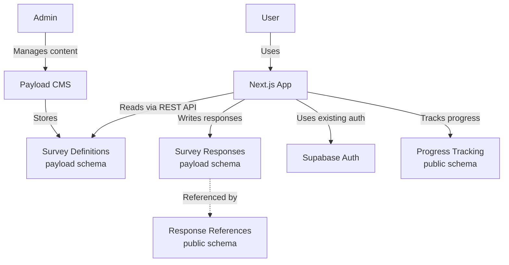

# Payload CMS Survey System Implementation Plan

This document outlines the detailed implementation plan for creating a survey system using Payload CMS integrated with Makerkit/Supabase authentication. This approach leverages schema separation to avoid complex authentication integration.

## 1. Overall Architecture

The architecture separates concerns between Payload CMS and Supabase:

- **Payload CMS (payload schema)**: Manages survey content, questions, and options
- **Supabase (public schema)**: Handles user authentication and bridges to user's survey responses
- **Next.js App**: Frontend that integrates both systems



## 2. Database Schema Design

### Payload Schema (Payload CMS)

#### Surveys Collection

```typescript
{
  slug: 'surveys',
  fields: [
    {
      name: 'title',
      type: 'text',
      required: true
    },
    {
      name: 'slug',
      type: 'text',
      required: true,
      unique: true
    },
    {
      name: 'description',
      type: 'textarea'
    },
    {
      name: 'status',
      type: 'select',
      options: [
        { label: 'Draft', value: 'draft' },
        { label: 'Published', value: 'published' }
      ],
      defaultValue: 'draft'
    },
    {
      name: 'startMessage',
      type: 'richText',
      editor: lexicalEditor({})
    },
    {
      name: 'endMessage',
      type: 'richText',
      editor: lexicalEditor({})
    },
    {
      name: 'showProgressBar',
      type: 'checkbox',
      defaultValue: true
    },
    {
      name: 'questions',
      type: 'relationship',
      relationTo: 'survey_questions',
      hasMany: true
    },
    {
      name: 'summaryContent',
      type: 'richText',
      editor: lexicalEditor({})
    }
  ],
  access: {
    read: () => true, // Public read access
  }
}
```

#### Survey Questions Collection

```typescript
{
  slug: 'survey_questions',
  fields: [
    {
      name: 'text',
      type: 'text',
      required: true
    },
    {
      name: 'type',
      type: 'select',
      options: [
        { label: 'Multiple Choice', value: 'multiple_choice' }
        // Future extensibility for other question types
      ],
      defaultValue: 'multiple_choice'
    },
    {
      name: 'description',
      type: 'textarea',
      admin: {
        description: 'Additional context or instructions for the question'
      }
    },
    {
      name: 'required',
      type: 'checkbox',
      defaultValue: true
    },
    {
      name: 'options',
      type: 'array',
      fields: [
        {
          name: 'option',
          type: 'text'
        }
      ]
    },
    {
      name: 'category',
      type: 'text',
      required: true
    },
    {
      name: 'questionspin',
      type: 'select',
      options: [
        { label: 'Positive', value: 'Positive' },
        { label: 'Negative', value: 'Negative' }
      ],
      defaultValue: 'Positive'
    },
    {
      name: 'position',
      type: 'number',
      defaultValue: 0,
      admin: {
        description: 'Position in the survey (lower numbers appear first)'
      }
    }
  ],
  access: {
    read: () => true, // Public read access
  }
}
```

#### Survey Responses Collection

```typescript
{
  slug: 'survey_responses',
  fields: [
    {
      name: 'userId',
      type: 'text',
      required: true
    },
    {
      name: 'survey',
      type: 'relationship',
      relationTo: 'surveys',
      required: true
    },
    {
      name: 'responses',
      type: 'json'
    },
    {
      name: 'progress',
      type: 'number',
      defaultValue: 0
    },
    {
      name: 'categoryScores',
      type: 'json'
    },
    {
      name: 'highestScoringCategory',
      type: 'text'
    },
    {
      name: 'lowestScoringCategory',
      type: 'text'
    },
    {
      name: 'completed',
      type: 'boolean',
      defaultValue: false
    },
    {
      name: 'createdAt',
      type: 'date',
      admin: {
        date: {
          pickerAppearance: 'dayAndTime'
        }
      }
    },
    {
      name: 'updatedAt',
      type: 'date',
      admin: {
        date: {
          pickerAppearance: 'dayAndTime'
        }
      }
    }
  ],
  hooks: {
    beforeChange: [
      ({ data }) => {
        const now = new Date().toISOString();
        if (!data.createdAt) {
          data.createdAt = now;
        }
        data.updatedAt = now;
        return data;
      }
    ]
  },
  access: {
    read: ({ req }) => {
      // Admin users can read all responses
      if (req.user?.email?.endsWith('@slideheroes.com')) return true;

      // Regular users can only see their own responses
      if (req.user?.id) {
        return {
          userId: { equals: req.user.id },
        };
      }

      return false;
    },
    create: ({ req }) => Boolean(req.user),
    update: ({ req }) => {
      if (req.user?.email?.endsWith('@slideheroes.com')) return true;

      if (req.user?.id) {
        return {
          userId: { equals: req.user.id },
        };
      }

      return false;
    },
    delete: ({ req }) => req.user?.email?.endsWith('@slideheroes.com'),
  }
}
```

### Public Schema (Supabase)

```sql
-- Acts as a "bridge" between users and their survey responses in Payload
CREATE TABLE IF NOT EXISTS public.survey_responses (
  id UUID PRIMARY KEY DEFAULT uuid_generate_v4(),
  user_id UUID NOT NULL REFERENCES auth.users(id) ON DELETE CASCADE,
  survey_id TEXT NOT NULL,
  response_id TEXT NOT NULL, -- Payload ID for the response
  created_at TIMESTAMP WITH TIME ZONE DEFAULT now(),
  UNIQUE(user_id, survey_id)
);

-- Row Level Security
ALTER TABLE public.survey_responses ENABLE ROW LEVEL SECURITY;

-- Users can see only their own responses
CREATE POLICY "Users can view their own responses"
  ON public.survey_responses
  FOR SELECT
  USING (auth.uid() = user_id);

-- Users can create their own responses
CREATE POLICY "Users can create their own responses"
  ON public.survey_responses
  FOR INSERT
  WITH CHECK (auth.uid() = user_id);

-- Users can update their own responses
CREATE POLICY "Users can update their own responses"
  ON public.survey_responses
  FOR UPDATE
  USING (auth.uid() = user_id);

-- Progress tracking stays in Supabase for quick access
CREATE TABLE IF NOT EXISTS public.survey_progress (
  id UUID PRIMARY KEY DEFAULT uuid_generate_v4(),
  user_id UUID NOT NULL REFERENCES auth.users(id) ON DELETE CASCADE,
  survey_id TEXT NOT NULL,
  current_question_index INTEGER DEFAULT 0,
  total_questions INTEGER NOT NULL,
  progress_percentage NUMERIC DEFAULT 0,
  last_answered_at TIMESTAMP WITH TIME ZONE DEFAULT now(),
  UNIQUE(user_id, survey_id)
);

-- Row Level Security
ALTER TABLE public.survey_progress ENABLE ROW LEVEL SECURITY;

-- Similar RLS policies as survey_responses
CREATE POLICY "Users can view their own progress"
  ON public.survey_progress
  FOR SELECT
  USING (auth.uid() = user_id);

CREATE POLICY "Users can create their own progress"
  ON public.survey_progress
  FOR INSERT
  WITH CHECK (auth.uid() = user_id);

CREATE POLICY "Users can update their own progress"
  ON public.survey_progress
  FOR UPDATE
  USING (auth.uid() = user_id);
```

## 3. API Layer Implementation

### Payload API Helper

```typescript
// packages/cms/payload/src/api/payload-api.ts
import { getSupabaseServerClient } from '@kit/supabase/server-client';

export async function callPayloadAPI(
  endpoint: string,
  options: RequestInit = {},
) {
  const supabase = getSupabaseServerClient();
  const {
    data: { session },
  } = await supabase.auth.getSession();

  const payloadUrl = process.env.PAYLOAD_PUBLIC_URL || 'http://localhost:3001';

  const response = await fetch(`${payloadUrl}/api/${endpoint}`, {
    ...options,
    headers: {
      ...options.headers,
      'Content-Type': 'application/json',
      Authorization: session ? `Bearer ${session.access_token}` : '',
    },
  });

  if (!response.ok) {
    const error = await response.json();
    throw new Error(error.message || 'Failed to call Payload API');
  }

  return response.json();
}
```

### Survey-Specific API Functions

```typescript
// packages/cms/payload/src/api/survey.ts
import { callPayloadAPI } from './payload-api';

export async function getSurvey(slug: string) {
  return callPayloadAPI(`surveys?where[slug][equals]=${slug}&depth=2`);
}

export async function getSurveyQuestions(surveyId: string) {
  const survey = await callPayloadAPI(`surveys/${surveyId}`);

  if (!survey?.questions?.length) return { docs: [] };

  const questionIds = survey.questions.map((q: any) => q.id).join(',');

  return callPayloadAPI(
    `survey_questions?where[id][in]=${questionIds}&sort=position&limit=100`,
  );
}

export async function getUserSurveyResponse(userId: string, surveyId: string) {
  return callPayloadAPI(
    `survey_responses?where[userId][equals]=${userId}&where[survey][equals]=${surveyId}`,
  );
}

export async function createSurveyResponse(data: any) {
  return callPayloadAPI('survey_responses', {
    method: 'POST',
    body: JSON.stringify(data),
  });
}

export async function updateSurveyResponse(id: string, data: any) {
  return callPayloadAPI(`survey_responses/${id}`, {
    method: 'PATCH',
    body: JSON.stringify(data),
  });
}

export async function completeSurvey(id: string, data: any) {
  return callPayloadAPI(`survey_responses/${id}`, {
    method: 'PATCH',
    body: JSON.stringify({
      ...data,
      completed: true,
    }),
  });
}
```

### Server Actions

```typescript
// apps/web/app/home/(user)/assessment/_lib/server/server-actions.ts
'use server';

import { z } from 'zod';

import {
  createSurveyResponse,
  updateSurveyResponse,
} from '@kit/cms/payload/api/survey';
import { enhanceAction } from '@kit/next/actions';
import { getSupabaseServerClient } from '@kit/supabase/server-client';

// apps/web/app/home/(user)/assessment/_lib/server/server-actions.ts

const SaveResponseSchema = z.object({
  surveyId: z.string(),
  questionId: z.string(),
  questionIndex: z.number(),
  response: z.string(),
  category: z.string(),
  score: z.number(),
  totalQuestions: z.number(),
});

export const saveResponseAction = enhanceAction(
  async function (data, user) {
    const supabase = getSupabaseServerClient();

    // Calculate progress percentage
    const progressPercentage =
      ((data.questionIndex + 1) / data.totalQuestions) * 100;

    // Check if user already has a response entry in Supabase
    const { data: existingResponseData } = await supabase
      .from('survey_responses')
      .select('id, response_id')
      .eq('user_id', user.id)
      .eq('survey_id', data.surveyId)
      .single();

    // Format the new response
    const newResponse = {
      questionId: data.questionId,
      response: data.response,
      score: data.score,
      category: data.category,
      answeredAt: new Date().toISOString(),
    };

    let payloadResponseId;

    if (existingResponseData?.response_id) {
      // Update existing record in Payload
      const payloadResponse = await updateSurveyResponse(
        existingResponseData.response_id,
        {
          responses: [...existingResponseData.responses, newResponse],
          progress: progressPercentage,
          completed: progressPercentage === 100,
        },
      );

      payloadResponseId = existingResponseData.response_id;
    } else {
      // Create new record in Payload
      const payloadResponse = await createSurveyResponse({
        userId: user.id,
        survey: data.surveyId,
        responses: [newResponse],
        progress: progressPercentage,
        completed: false,
      });

      payloadResponseId = payloadResponse.doc.id;

      // Store the reference in Supabase
      await supabase.from('survey_responses').insert({
        user_id: user.id,
        survey_id: data.surveyId,
        response_id: payloadResponseId,
      });
    }

    // Update progress in Supabase
    await supabase.from('survey_progress').upsert(
      {
        user_id: user.id,
        survey_id: data.surveyId,
        current_question_index: data.questionIndex + 1,
        total_questions: data.totalQuestions,
        progress_percentage: progressPercentage,
        last_answered_at: new Date().toISOString(),
      },
      { onConflict: 'user_id,survey_id' },
    );

    return { success: true };
  },
  {
    auth: true,
    schema: SaveResponseSchema,
  },
);

const CompleteSurveySchema = z.object({
  surveyId: z.string(),
  responseId: z.string(),
  categoryScores: z.record(z.string(), z.number()),
  highestScoringCategory: z.string(),
  lowestScoringCategory: z.string(),
});

export const completeSurveyAction = enhanceAction(
  async function (data, user) {
    await updateSurveyResponse(data.responseId, {
      completed: true,
      categoryScores: data.categoryScores,
      highestScoringCategory: data.highestScoringCategory,
      lowestScoringCategory: data.lowestScoringCategory,
    });

    return { success: true };
  },
  {
    auth: true,
    schema: CompleteSurveySchema,
  },
);
```

## 4. Frontend Components

### Main Assessment Page

```typescript
// apps/web/app/home/(user)/assessment/page.tsx
import { redirect } from 'next/navigation';
import Link from 'next/link';

import { getSupabaseServerClient } from '@kit/supabase/server-client';
import { Button } from '@kit/ui/button';
import { getSurvey } from '@kit/cms/payload/api/survey';

export const metadata = {
  title: 'Self-Assessment Survey Introduction',
};

export default async function AssessmentIntroPage() {
  const client = getSupabaseServerClient();
  const {
    data: { user },
  } = await client.auth.getUser();

  if (!user) {
    redirect('/auth/sign-in');
  }

  // Get the assessment survey
  const surveyData = await getSurvey('assessment');
  const survey = surveyData.docs[0];

  return (
    <div className="flex min-h-screen flex-col items-center justify-center bg-background">
      <div className="mx-auto max-w-2xl rounded-lg bg-card p-8 shadow-lg">
        <h1 className="mb-6 text-center text-3xl font-bold">
          {survey.title}
        </h1>
        <div className="mb-6" dangerouslySetInnerHTML={{ __html: survey.startMessage }} />
        <div className="flex justify-center">
          <Link href="/home/assessment/survey">
            <Button
              size="lg"
              className="bg-primary text-primary-foreground hover:bg-primary/90"
            >
              Take Survey
            </Button>
          </Link>
        </div>
      </div>
    </div>
  );
}
```

### Survey Page

```typescript
// apps/web/app/home/(user)/assessment/survey/page.tsx
import { redirect } from 'next/navigation';
import { ErrorBoundary } from 'react-error-boundary';

import { getSupabaseServerClient } from '@kit/supabase/server-client';
import { getSurvey, getSurveyQuestions } from '@kit/cms/payload/api/survey';

import { SurveyPageClient } from './_components/SurveyPageClient';
import { ErrorFallback } from './_components/ErrorFallback';

export const metadata = {
  title: 'Self-Assessment Survey',
};

export default async function SurveyPage() {
  try {
    const client = getSupabaseServerClient();
    const {
      data: { user },
    } = await client.auth.getUser();

    if (!user) {
      redirect('/auth/sign-in');
    }

    // Get the assessment survey
    const surveyData = await getSurvey('assessment');
    const survey = surveyData.docs[0];

    if (!survey) {
      throw new Error('Survey not found');
    }

    // Get survey questions
    const questionsData = await getSurveyQuestions(survey.id);
    const questions = questionsData.docs;

    if (!questions || questions.length === 0) {
      throw new Error('Survey has no questions');
    }

    const mappedQuestions = questions.map((q) => ({
      id: q.id,
      type: q.type,
      text: q.text,
      question: q.text,
      description: q.description,
      options: q.options,
      category: q.category,
      questionspin: q.questionspin,
      required: q.required,
    }));

    return (
      <ErrorBoundary FallbackComponent={ErrorFallback}>
        <div className="flex flex-col space-y-6">
          <SurveyPageClient
            survey={{
              id: survey.id,
              title: survey.title,
              content: survey.description,
              questions: mappedQuestions,
              showProgressBar: survey.showProgressBar,
            }}
            studentName={user.user_metadata.full_name}
            surveyId={survey.id}
          />
        </div>
      </ErrorBoundary>
    );
  } catch (error) {
    console.error('Error in SurveyPage:', error);
    return <ErrorFallback error={error as Error} />;
  }
}
```

### Survey Container Component

```typescript
// apps/web/app/home/(user)/assessment/survey/_components/SurveyContainer.tsx
'use client';

import { useCallback, useEffect, useState } from 'react';
import { useRouter } from 'next/navigation';
import { toast } from 'sonner';

import { useSupabase } from '@kit/supabase/hooks/use-supabase';
import { Toaster } from '@kit/ui/sonner';

import { useSurvey } from '../_lib/client/hooks/use-survey';
import { SurveyQuestion } from './SurveyQuestion';
import { SurveySummary } from './SurveySummary';
import { SurveyProgressBar } from './SurveyProgressBar';

interface SurveyContainerProps {
  survey: Survey;
  userId: string;
  userName: string | null;
}

export function SurveyContainer({ survey, userId, userName }: SurveyContainerProps) {
  const router = useRouter();
  const supabase = useSupabase();
  const {
    questionResponses,
    currentQuestionIndex,
    showSummary,
    categoryScores,
    isLoading,
    error,
    handleNextQuestion,
    handleUpdateResponse,
    handleSurveyCompletion
  } = useSurvey(survey, userId);

  if (isLoading) {
    return <div>Loading survey data...</div>;
  }

  if (error) {
    return <div>Error: {error}</div>;
  }

  return (
    <div className="flex flex-col space-y-6">
      <div className="mb-6 border-b border-gray-200 pb-4">
        <div className="flex items-center justify-center">
          <h1 className="text-2xl font-bold text-gray-900">{survey.title}</h1>
        </div>
      </div>

      {survey.showProgressBar && (
        <SurveyProgressBar
          currentQuestion={currentQuestionIndex + 1}
          totalQuestions={survey.questions.length}
        />
      )}

      <div className="mt-8">
        {!showSummary ? (
          <SurveyQuestion
            survey={survey}
            currentQuestionIndex={currentQuestionIndex}
            onNextQuestion={handleNextQuestion}
            updateResponse={handleUpdateResponse}
            isLastQuestion={currentQuestionIndex === survey.questions.length - 1}
            onSurveyComplete={handleSurveyCompletion}
          />
        ) : (
          <SurveySummary
            categoryScores={categoryScores}
            onRetry={() => router.push('/home/assessment')}
          />
        )}
      </div>
      <Toaster />
    </div>
  );
}
```

### Custom Survey Hooks

```typescript
// apps/web/app/home/(user)/assessment/survey/_lib/client/hooks/use-survey.ts
'use client';

import { useCallback, useEffect, useState } from 'react';

import { useMutation, useQuery } from '@tanstack/react-query';

import { useSupabase } from '@kit/supabase/hooks/use-supabase';

import {
  completeSurveyAction,
  saveResponseAction,
} from '../../_lib/server/server-actions';

// apps/web/app/home/(user)/assessment/survey/_lib/client/hooks/use-survey.ts

export function useSurvey(survey, userId) {
  const [questionResponses, setQuestionResponses] = useState([]);
  const [currentQuestionIndex, setCurrentQuestionIndex] = useState(0);
  const [showSummary, setShowSummary] = useState(false);
  const [categoryScores, setCategoryScores] = useState({});
  const [isLoading, setIsLoading] = useState(true);
  const [error, setError] = useState(null);

  const supabase = useSupabase();

  // Fetch existing progress
  const { data: progressData } = useQuery({
    queryKey: ['surveyProgress', survey.id, userId],
    queryFn: async () => {
      const { data } = await supabase
        .from('survey_progress')
        .select('*')
        .eq('user_id', userId)
        .eq('survey_id', survey.id)
        .single();

      return data;
    },
    enabled: !!userId && !!survey.id,
  });

  // Initialize from progress data
  useEffect(() => {
    if (progressData) {
      setCurrentQuestionIndex(progressData.current_question_index);
      setIsLoading(false);
    } else {
      setIsLoading(false);
    }
  }, [progressData]);

  // Calculate category scores
  const calculateCategoryScores = useCallback((responses) => {
    const scores = {};
    const categoryCounts = {};

    responses.forEach((response) => {
      if (!response) return;

      const { category, score } = response;

      if (!scores[category]) {
        scores[category] = 0;
        categoryCounts[category] = 0;
      }

      scores[category] += score;
      categoryCounts[category]++;
    });

    // Calculate averages
    Object.keys(scores).forEach((category) => {
      scores[category] = scores[category] / categoryCounts[category];
    });

    return scores;
  }, []);

  // Handle response updates
  const handleUpdateResponse = useCallback(
    (response, category) => {
      const currentQuestion = survey.questions[currentQuestionIndex];

      // Calculate score based on response and question spin
      const scoreMap = {
        'Strongly disagree':
          currentQuestion.questionspin === 'Positive' ? 1 : 5,
        Disagree: currentQuestion.questionspin === 'Positive' ? 2 : 4,
        'Neither agree nor disagree': 3,
        Agree: currentQuestion.questionspin === 'Positive' ? 4 : 2,
        'Strongly agree': currentQuestion.questionspin === 'Positive' ? 5 : 1,
      };

      const score = scoreMap[response];

      setQuestionResponses((prev) => {
        const newResponses = [...prev];
        newResponses[currentQuestionIndex] = {
          questionId: currentQuestion.id,
          response,
          score,
          category,
        };
        return newResponses;
      });
    },
    [currentQuestionIndex, survey.questions],
  );

  // Save response mutation
  const saveResponseMutation = useMutation({
    mutationFn: async (data) => {
      return saveResponseAction(data);
    },
  });

  // Handle navigation to next question
  const handleNextQuestion = useCallback(
    async (response, category) => {
      handleUpdateResponse(response, category);

      const currentQuestion = survey.questions[currentQuestionIndex];

      // Save this response
      await saveResponseMutation.mutateAsync({
        surveyId: survey.id,
        questionId: currentQuestion.id,
        questionIndex: currentQuestionIndex,
        response,
        category,
        score: calculateScoreForResponse(
          response,
          currentQuestion.questionspin,
        ),
        totalQuestions: survey.questions.length,
      });

      // If last question, complete survey
      if (currentQuestionIndex === survey.questions.length - 1) {
        handleSurveyCompletion();
      } else {
        // Move to next question
        setCurrentQuestionIndex((prevIndex) => prevIndex + 1);
      }
    },
    [currentQuestionIndex, survey, handleUpdateResponse, saveResponseMutation],
  );

  // Complete survey mutation
  const completeSurveyMutation = useMutation({
    mutationFn: async (data) => {
      return completeSurveyAction(data);
    },
  });

  // Handle survey completion
  const handleSurveyCompletion = useCallback(async () => {
    // Calculate final scores
    const scores = calculateCategoryScores(questionResponses);
    setCategoryScores(scores);

    // Find highest and lowest scoring categories
    const categories = Object.keys(scores);
    const highestCategory = categories.reduce(
      (max, category) => (scores[category] > scores[max] ? category : max),
      categories[0],
    );

    const lowestCategory = categories.reduce(
      (min, category) => (scores[category] < scores[min] ? category : min),
      categories[0],
    );

    // Get response ID from Supabase
    const { data: responseRef } = await supabase
      .from('survey_responses')
      .select('response_id')
      .eq('user_id', userId)
      .eq('survey_id', survey.id)
      .single();

    if (responseRef?.response_id) {
      // Complete the survey
      await completeSurveyMutation.mutateAsync({
        surveyId: survey.id,
        responseId: responseRef.response_id,
        categoryScores: scores,
        highestScoringCategory: highestCategory,
        lowestScoringCategory: lowestCategory,
      });
    }

    // Show survey summary
    setShowSummary(true);
  }, [
    questionResponses,
    calculateCategoryScores,
    userId,
    survey.id,
    supabase,
    completeSurveyMutation,
  ]);

  return {
    questionResponses,
    currentQuestionIndex,
    showSummary,
    categoryScores,
    isLoading,
    error,
    handleNextQuestion,
    handleUpdateResponse,
    handleSurveyCompletion,
  };
}

// Helper function
function calculateScoreForResponse(response, questionspin) {
  const scoreMap = {
    'Strongly disagree': questionspin === 'Positive' ? 1 : 5,
    Disagree: questionspin === 'Positive' ? 2 : 4,
    'Neither agree nor disagree': 3,
    Agree: questionspin === 'Positive' ? 4 : 2,
    'Strongly agree': questionspin === 'Positive' ? 5 : 1,
  };

  return scoreMap[response];
}
```

## 5. Admin Analytics Implementation

### Admin Survey List Page

```typescript
// apps/web/app/admin/surveys/page.tsx
import { redirect } from 'next/navigation';
import Link from 'next/link';

import { getSupabaseServerClient } from '@kit/supabase/server-client';
import { callPayloadAPI } from '@kit/cms/payload/api/payload-api';
import { Button } from '@kit/ui/button';
import {
  Table,
  TableBody,
  TableCell,
  TableHead,
  TableHeader,
  TableRow,
} from '@kit/ui/table';

export const metadata = {
  title: 'Survey Management',
};

export default async function SurveysAdminPage() {
  const client = getSupabaseServerClient();
  const {
    data: { user },
  } = await client.auth.getUser();

  if (!user) {
    redirect('/auth/sign-in');
  }

  // Check admin status
  const
```
