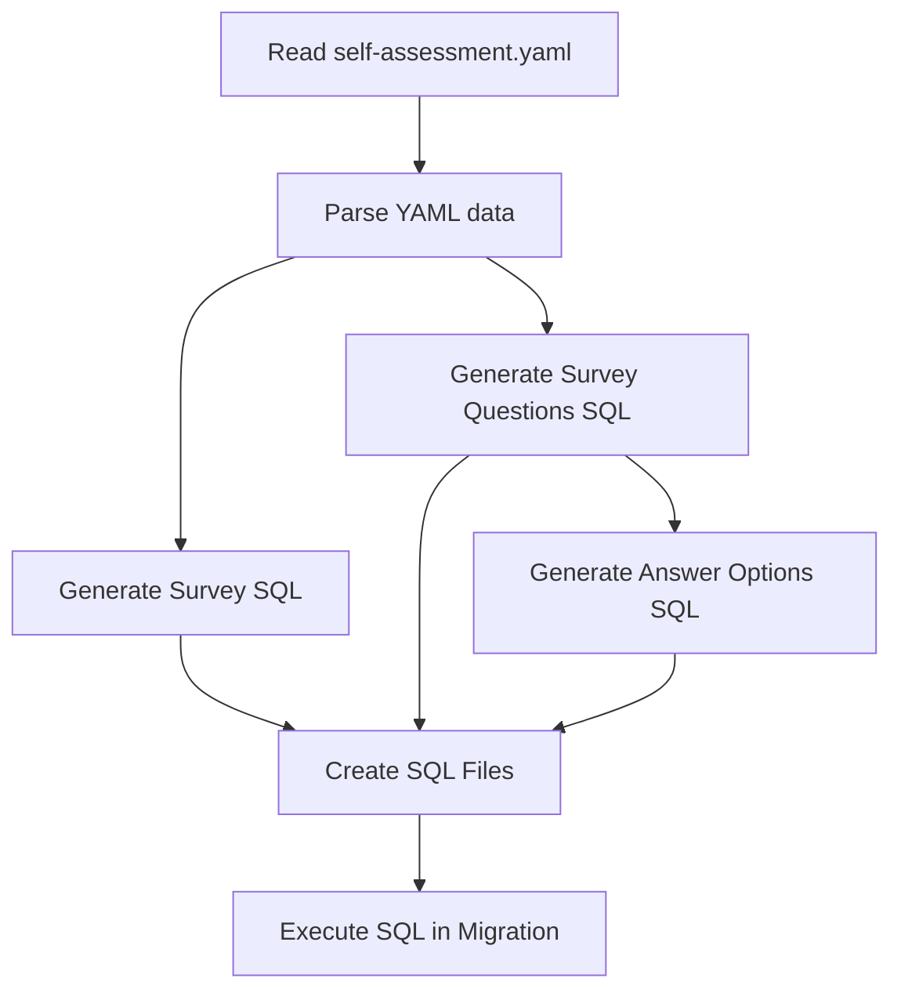

# Self-Assessment Survey Content Migration Fix Plan

## Problem Statement

Our content migration system is not adding data for our self-assessment survey. The survey data exists in `packages/content-migrations/src/data/raw/surveys/self-assessment.yaml` but is not being properly processed and populated into the Payload CMS tables.

## Root Cause Analysis

After examining the content migration system, I've identified the root cause of why the self-assessment survey data is not being populated in the Payload CMS tables:

1. **Placeholder SQL Generation**: The functions `generateSurveysSql()` and `generateSurveyQuestionsSql()` in `packages/content-migrations/src/scripts/sql/generate-sql-seed-files-fixed.ts` are just placeholders that create a single hardcoded sample survey and question, rather than processing the actual survey data from `packages/content-migrations/src/data/raw/surveys/self-assessment.yaml`.

2. **Verification Confirms Missing Data**: The migration logs show that during verification, there are "0 survey questions with surveys_id" despite having a raw survey data file with 25 questions.

3. **Raw Data Exists**: The `self-assessment.yaml` file exists and contains a comprehensive self-assessment survey with 25 questions, each with 5 answer options, but this data is not being processed.

## Execution Flow

The execution chain for the content migration system is:

```
reset-and-migrate.ps1 → pnpm run process:raw-data → process-raw-data.ts → generate-sql-seed-files-fixed.ts
```

The `process-raw-data.ts` script imports and calls the `generateSqlSeedFiles` function from `generate-sql-seed-files-fixed.ts`, which in turn calls the placeholder functions `generateSurveysSql()` and `generateSurveyQuestionsSql()`.

## Detailed Solution Plan

To fix this issue, we need to implement proper processing of the survey data from the YAML file:

### 1. Update the SQL Generation Functions

We need to modify the `generateSurveysSql()` and `generateSurveyQuestionsSql()` functions in `generate-sql-seed-files-fixed.ts` to:

- Read the survey YAML file
- Parse the survey data
- Generate proper SQL statements for the survey and its questions

### 2. Implementation Steps

1. **Update `generateSurveysSql()`**:

   - Read the `self-assessment.yaml` file
   - Parse the YAML data
   - Generate SQL to insert the survey with proper metadata (title, slug, description, etc.)

2. **Update `generateSurveyQuestionsSql()`**:

   - Process each question from the parsed YAML data
   - Generate SQL to insert each question with its properties (text, category, questionspin, etc.)
   - Generate SQL for the answer options for each question
   - Create proper relationship entries between surveys and questions

3. **Add YAML Processing**:
   - Ensure the YAML parser is properly imported and used
   - Handle the specific structure of the self-assessment survey data

### 3. Code Implementation Plan



## Implementation Details

Here's a detailed breakdown of the changes needed:

1. **Update `generateSurveysSql()`**:

```typescript
function generateSurveysSql(): string {
  // Read the self-assessment.yaml file
  const surveyFilePath = path.join(RAW_SURVEYS_DIR, 'self-assessment.yaml');
  if (!fs.existsSync(surveyFilePath)) {
    console.warn(`Survey file not found: ${surveyFilePath}`);
    return generatePlaceholderSurveysSql();
  }

  // Parse the YAML data
  const surveyContent = fs.readFileSync(surveyFilePath, 'utf8');
  const surveyData = yaml.parse(surveyContent);

  // Generate SQL for the survey
  const surveyId = '5e352ade-c6a9-4e4a-9ffa-9680a5d5f9e9'; // Fixed UUID for consistency
  const surveySlug = surveyData.title
    .toLowerCase()
    .replace(/[^\w\s]/g, '')
    .replace(/\s+/g, '-');

  return `-- Seed data for the surveys table
-- This file should be run after the migrations to ensure the surveys table exists

-- Start a transaction
BEGIN;

-- Insert the self-assessment survey
INSERT INTO payload.surveys (
  id,
  title,
  slug,
  description,
  status,
  created_at,
  updated_at
) VALUES (
  '${surveyId}',
  '${surveyData.title.replace(/'/g, "''")}',
  '${surveySlug}',
  'Self-assessment survey for presentation skills',
  '${surveyData.status || 'published'}',
  NOW(),
  NOW()
) ON CONFLICT (id) DO NOTHING;

-- Commit the transaction
COMMIT;
`;
}
```

2. **Update `generateSurveyQuestionsSql()`**:

```typescript
function generateSurveyQuestionsSql(): string {
  // Read the self-assessment.yaml file
  const surveyFilePath = path.join(RAW_SURVEYS_DIR, 'self-assessment.yaml');
  if (!fs.existsSync(surveyFilePath)) {
    console.warn(`Survey file not found: ${surveyFilePath}`);
    return generatePlaceholderSurveyQuestionsSql();
  }

  // Parse the YAML data
  const surveyContent = fs.readFileSync(surveyFilePath, 'utf8');
  const surveyData = yaml.parse(surveyContent);

  // Survey ID (must match the ID used in generateSurveysSql)
  const surveyId = '5e352ade-c6a9-4e4a-9ffa-9680a5d5f9e9';

  // Start building the SQL
  let sql = `-- Seed data for the survey questions table
-- This file should be run after the surveys seed file to ensure the surveys exist

-- Start a transaction
BEGIN;

`;

  // Process each question
  if (surveyData.questions && Array.isArray(surveyData.questions)) {
    for (let i = 0; i < surveyData.questions.length; i++) {
      const question = surveyData.questions[i];
      const questionId = uuidv4();

      // Add the question to the SQL
      sql += `-- Insert question ${i + 1}: ${question.question.substring(0, 50)}...
INSERT INTO payload.survey_questions (
  id,
  text,
  type,
  category,
  questionspin,
  position,
  surveys_id,
  required,
  created_at,
  updated_at
) VALUES (
  '${questionId}',
  '${question.question.replace(/'/g, "''")}',
  'multiple_choice',
  '${question.questioncategory || ''}',
  '${question.questionspin || 'Positive'}',
  ${i},
  '${surveyId}',
  true,
  NOW(),
  NOW()
) ON CONFLICT (id) DO NOTHING;

`;

      // Process answer options
      if (question.answers && Array.isArray(question.answers)) {
        for (let j = 0; j < question.answers.length; j++) {
          const answer = question.answers[j];

          // Add the option to the SQL
          sql += `-- Insert option ${j + 1} for question ${i + 1}
INSERT INTO payload.survey_questions_options (
  id,
  _order,
  _parent_id,
  option,
  created_at,
  updated_at
) VALUES (
  gen_random_uuid(),
  ${j},
  '${questionId}',
  '${answer.answer.replace(/'/g, "''")}',
  NOW(),
  NOW()
) ON CONFLICT DO NOTHING;

`;
        }
      }

      // Create relationship entry for the question to the survey
      sql += `-- Create relationship entry for the question to the survey
INSERT INTO payload.survey_questions_rels (
  id,
  _parent_id,
  field,
  value,
  created_at,
  updated_at
) VALUES (
  gen_random_uuid(),
  '${questionId}',
  'surveys',
  '${surveyId}',
  NOW(),
  NOW()
) ON CONFLICT DO NOTHING;

`;

      // Create bidirectional relationship entry for the survey to the question
      sql += `-- Create bidirectional relationship entry for the survey to the question
INSERT INTO payload.surveys_rels (
  id,
  _parent_id,
  field,
  value,
  survey_questions_id,
  created_at,
  updated_at
) VALUES (
  gen_random_uuid(),
  '${surveyId}',
  'questions',
  '${questionId}',
  '${questionId}',
  NOW(),
  NOW()
) ON CONFLICT DO NOTHING;

`;
    }
  }

  // End the transaction
  sql += `-- Commit the transaction
COMMIT;
`;

  return sql;
}
```

3. **Add YAML Import**:

```typescript
import yaml from 'yaml';

// Add this import at the top of the file
```

## Testing and Verification

After implementing these changes, we'll need to:

1. Run the raw data processing:

   ```bash
   pnpm --filter @kit/content-migrations run process:raw-data
   ```

2. Run the reset and migrate script:

   ```bash
   ./reset-and-migrate.ps1
   ```

3. Verify the survey data was properly populated:
   - Check the `payload.surveys` table for the self-assessment survey
   - Check the `payload.survey_questions` table for the 25 questions
   - Check the `payload.survey_questions_options` table for the answer options
   - Verify the relationships between surveys and questions

## Conclusion

The self-assessment survey data is not being populated because the SQL generation functions for surveys are just placeholders that don't actually process the YAML file. By implementing proper YAML processing and SQL generation for the survey data, we can fix this issue and ensure the self-assessment survey is properly populated in the Payload CMS tables.
