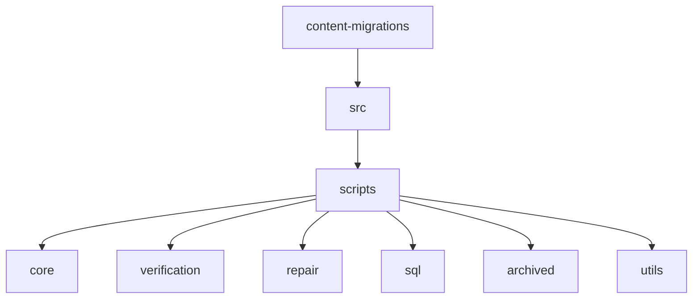
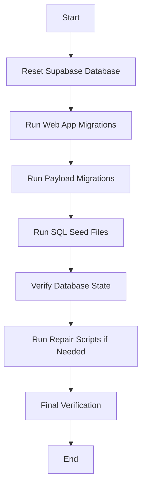

# Script Rationalization Plan

This document outlines a comprehensive plan to rationalize the scripts in the content migration system, clarify their purpose, and implement a more SQL-first approach.

## Current State Analysis

### Database Structure

- The database has two main schemas: `public` (web app) and `payload` (CMS)
- The `payload` schema contains tables for courses, lessons, quizzes, questions, surveys, etc.
- There are relationship tables (e.g., `course_lessons_rels`, `quiz_questions_rels`) to manage associations

### Migration Process (reset-and-migrate.ps1)

The current process follows these steps:

1. Reset Supabase database and run web app migrations
2. Run Payload migrations (creating schema and tables)
3. Run content migrations (populating tables with data)
4. Verify database state and fix any issues
5. Skip SQL seed files (now handled by Payload migrations)

### Script Categories

We've identified several categories of scripts:

1. **Core Migration Scripts**:

   - `migrate-all-direct-fixed.ts` - Main orchestration script
   - Migration scripts for different content types (lessons, quizzes, etc.)

2. **Verification Scripts**:

   - `verify-all-relationships.ts`
   - `verify-course-lessons-quiz-id-column.ts`
   - `verify-media-columns.ts`

3. **Repair Scripts**:

   - `repair-edge-cases.ts`
   - `fix-relationships-direct.ts`

4. **SQL-Based Scripts**:

   - `generate-sql-seed-files-fixed.ts`
   - `run-all-sql-seeds.ts`

5. **Archived/Deprecated Scripts**:
   - Various scripts in the `archived` directory

### Evolution of Migration Approach

We can see a clear evolution in the migration approach:

1. Initially using TypeScript scripts to directly migrate content
2. Moving toward SQL-based migrations with seed files
3. Finally integrating with Payload's migration system (as seen in `20250402_305000_seed_course_data.ts`)

## Issues Identified

1. **Script Redundancy**: Many scripts perform similar functions but with slight variations
2. **Unclear Categorization**: Scripts are mixed together without clear organization
3. **Outdated Scripts**: Some scripts are no longer needed but haven't been properly archived
4. **Inconsistent Naming**: Script naming doesn't clearly indicate purpose or status
5. **SQL vs. TypeScript Approach**: There's a mix of approaches without clear guidance on which to use

## Rationalization Plan

### 1. Script Categorization and Organization

We'll reorganize scripts into clear categories:



### 2. Script Categorization and Detailed Analysis

#### Core Migration Scripts

**Keep and Organize:**

- `migrate-all-direct-fixed.ts` → Move to `scripts/core/`
- `migrate-course-lessons-direct.ts` → Move to `scripts/core/`
- `migrate-course-quizzes-direct.ts` → Move to `scripts/core/`
- `migrate-quiz-questions-direct-fixed.ts` → Move to `scripts/core/`
- `migrate-docs-direct.ts` → Move to `scripts/core/`
- `migrate-surveys-direct.ts` → Move to `scripts/core/`
- `migrate-survey-questions-direct.ts` → Move to `scripts/core/`
- `migrate-posts-direct.ts` → Move to `scripts/core/`

**Archive (No Longer Needed):**

- `migrate-payload-quizzes-direct.ts` → Move to `scripts/archived/`
- `migrate-payload-docs.ts` → Move to `scripts/archived/`

#### Verification Scripts

**Keep and Organize:**

- All scripts in `scripts/verification/` should remain there
- `test-database-connection-direct.ts` → Move to `scripts/verification/`

#### Repair Scripts

**Keep and Organize:**

- All scripts in `scripts/repair/` should remain there

#### SQL Scripts

**Keep and Organize:**

- All scripts in `scripts/sql/` should remain there

#### Utility Scripts

**Keep and Organize:**

- `create-admin-user-local-bcrypt.ts` → Move to `scripts/utils/`
- `create-admin-user-payload-api.ts` → Move to `scripts/utils/`
- `create-course.ts` → Move to `scripts/utils/`

#### Archive Additional Scripts

**Archive (Superseded by SQL or Payload Migrations):**

- `seed-course-data.ts` → Move to `scripts/archived/`
- `run-seed-course-data.ts` → Move to `scripts/archived/`
- `test-lesson-data.ts` → Move to `scripts/archived/`

### 3. SQL-First Approach Implementation

#### SQL Migration Templates

Create standardized SQL migration templates for different content types:

1. **Table Creation Template**

```sql
-- Create [table_name] table
CREATE TABLE IF NOT EXISTS payload.[table_name] (
  id UUID PRIMARY KEY DEFAULT gen_random_uuid(),
  -- Add columns here
  created_at TIMESTAMPTZ DEFAULT NOW(),
  updated_at TIMESTAMPTZ DEFAULT NOW()
);

-- Create relationships table if needed
CREATE TABLE IF NOT EXISTS payload.[table_name]_rels (
  id UUID PRIMARY KEY DEFAULT gen_random_uuid(),
  _parent_id UUID REFERENCES payload.[table_name](id) ON DELETE CASCADE,
  field TEXT NOT NULL,
  value UUID NOT NULL,
  created_at TIMESTAMPTZ DEFAULT NOW(),
  updated_at TIMESTAMPTZ DEFAULT NOW()
);
```

2. **Content Seeding Template**

```sql
-- Seed data for [table_name]
INSERT INTO payload.[table_name] (
  id,
  -- Add columns here
  created_at,
  updated_at
) VALUES (
  gen_random_uuid(),
  -- Add values here
  NOW(),
  NOW()
) ON CONFLICT (id) DO NOTHING;

-- Create relationships if needed
INSERT INTO payload.[table_name]_rels (
  id,
  _parent_id,
  field,
  value,
  created_at,
  updated_at
) VALUES (
  gen_random_uuid(),
  -- Add values here
  NOW(),
  NOW()
) ON CONFLICT DO NOTHING;
```

#### Integration with Payload Migrations

Create a utility function to simplify creating new Payload migrations that use SQL:

```typescript
// utils/create-sql-migration.ts
import fs from 'fs';
import path from 'path';

/**
 * Creates a new SQL-based Payload migration
 * @param name Migration name
 * @param sqlContent SQL content for the migration
 */
export function createSqlMigration(name: string, sqlContent: string): void {
  const timestamp = Date.now();
  const migrationName = `${timestamp}_${name}.ts`;
  const migrationPath = path.resolve(
    process.cwd(),
    'apps/payload/src/migrations',
    migrationName,
  );

  const migrationContent = `
import { MigrateUpArgs, MigrateDownArgs, sql } from '@payloadcms/db-postgres';

export async function up({ db, payload }: MigrateUpArgs): Promise<void> {
  console.log('Running ${name} migration');

  try {
    // Execute the SQL
    await db.execute(sql\`
${sqlContent}
    \`);

    console.log('${name} migration completed successfully');
  } catch (error) {
    console.error('Error in ${name} migration:', error);
    throw error;
  }
}

export async function down({ db, payload }: MigrateDownArgs): Promise<void> {
  console.log('Running down migration for ${name}');

  try {
    // Add down migration SQL here
    
    console.log('${name} down migration completed successfully');
  } catch (error) {
    console.error('Error in ${name} down migration:', error);
    throw error;
  }
}
`;

  fs.writeFileSync(migrationPath, migrationContent);
  console.log(`Created migration: ${migrationPath}`);
}
```

### 4. New Migration Process Flow

Update the migration process to follow this flow:



### 5. Package.json Updates

Update the `packages/content-migrations/package.json` scripts section to reflect the new organization:

```json
"scripts": {
  "test:db:direct": "tsx src/scripts/verification/test-database-connection-direct.ts",

  "migrate:all": "tsx src/scripts/core/migrate-all-direct-fixed.ts",
  "migrate:course-lessons": "tsx src/scripts/core/migrate-course-lessons-direct.ts",
  "migrate:course-quizzes": "tsx src/scripts/core/migrate-course-quizzes-direct.ts",
  "migrate:quiz-questions": "tsx src/scripts/core/migrate-quiz-questions-direct-fixed.ts",
  "migrate:docs": "tsx src/scripts/core/migrate-docs-direct.ts",
  "migrate:surveys": "tsx src/scripts/core/migrate-surveys-direct.ts",
  "migrate:survey-questions": "tsx src/scripts/core/migrate-survey-questions-direct.ts",
  "migrate:posts": "tsx src/scripts/core/migrate-posts-direct.ts",

  "verify:all": "tsx src/scripts/verification/verify-all-relationships.ts",
  "verify:course-lessons": "tsx src/scripts/verification/verify-course-lessons-quiz-id-column.ts",
  "verify:media-columns": "tsx src/scripts/verification/verify-media-columns.ts",
  "verify:schema": "tsx src/scripts/verification/verify-schema.ts",
  "verify:table": "tsx src/scripts/verification/verify-table.ts",
  "verify:database": "tsx src/scripts/verification/verify-database-schema.ts",

  "repair:edge-cases": "tsx src/scripts/repair/repair-edge-cases.ts",
  "repair:relationships": "tsx src/scripts/repair/fix-relationships-direct.ts",

  "sql:generate-seeds": "tsx src/scripts/sql/generate-sql-seed-files-fixed.ts",
  "sql:run-seeds": "tsx src/scripts/sql/run-all-sql-seeds.ts",

  "utils:create-admin": "tsx src/scripts/utils/create-admin-user-local-bcrypt.ts",
  "utils:create-course": "tsx src/scripts/utils/create-course.ts"
}
```

### 6. Documentation File Structure

Create a comprehensive documentation file at `packages/content-migrations/README.md`:

```markdown
# Content Migration System

This package contains scripts for migrating content to the Payload CMS collections.

## Directory Structure

- `src/scripts/core/` - Core migration scripts
- `src/scripts/verification/` - Scripts for verifying database state
- `src/scripts/repair/` - Scripts for repairing database issues
- `src/scripts/sql/` - SQL-based migration scripts
- `src/scripts/utils/` - Utility scripts
- `src/scripts/archived/` - Archived scripts (no longer used)

## Migration Process

The migration process follows these steps:

1. Reset Supabase database and run web app migrations
2. Run Payload migrations (creating schema and tables)
3. Run SQL seed files
4. Verify database state and fix any issues

## SQL-First Approach

We are moving toward a SQL-first approach for migrations:

1. Create SQL migration files in `apps/payload/src/migrations`
2. Use Payload's migration system to execute the SQL
3. Use SQL seed files for content seeding

## Available Scripts

### Core Migration Scripts

- `pnpm migrate:all` - Run all migrations
- `pnpm migrate:course-lessons` - Migrate course lessons
- ...

### Verification Scripts

- `pnpm verify:all` - Verify all relationships
- ...

### Repair Scripts

- `pnpm repair:edge-cases` - Repair edge cases
- ...

### SQL Scripts

- `pnpm sql:generate-seeds` - Generate SQL seed files
- `pnpm sql:run-seeds` - Run SQL seed files
- ...

### Utility Scripts

- `pnpm utils:create-admin` - Create admin user
- ...
```

### 7. Reset-and-Migrate.ps1 Updates

Update the `reset-and-migrate.ps1` script to reflect the new organization:

```powershell
# STEP 3: Run content migrations and verification
Log-Message "STEP 3: Running content migrations and verification..." "Cyan"
try {
    # Use Push-Location/Pop-Location instead of cd to maintain path context
    Push-Location -Path "packages/content-migrations"
    Log-Message "Changed directory to: $(Get-Location)" "Gray"

    Log-Message "  Running SQL seed files..." "Yellow"
    Exec-Command -command "pnpm run sql:run-seeds" -description "Running SQL seed files"

    Log-Message "  Verifying database state..." "Yellow"
    $verificationResult = Exec-Command -command "pnpm run verify:all" -description "Verifying database relationships" -captureOutput

    # Check if verification found any issues
    if ($verificationResult -match "Warning" -or $verificationResult -match "Error") {
        Log-Message "WARNING: Verification found issues, running edge case repairs..." "Yellow"

        Log-Message "  Running edge case repairs..." "Yellow"
        Exec-Command -command "pnpm run repair:edge-cases" -description "Running edge case repairs"

        Log-Message "  Final verification..." "Yellow"
        $finalVerification = Exec-Command -command "pnpm run verify:all" -description "Final verification" -captureOutput

        if ($finalVerification -match "Warning" -or $finalVerification -match "Error") {
            Log-Message "WARNING: Some issues could not be fixed automatically" "Yellow"
            $overallSuccess = $false
        }
        else {
            Log-Message "  All issues have been fixed" "Green"
        }
    }
    else {
        Log-Message "  No issues found, skipping repairs" "Green"
    }

    Pop-Location
    Log-Message "Returned to directory: $(Get-Location)" "Gray"
}
catch {
    Log-Message "ERROR: Failed to run content migrations: $_" "Red"
    $overallSuccess = $false
    throw "Content migration failed"
}
```

## Implementation Steps

1. Create the directory structure for the reorganized scripts
2. Move scripts to their appropriate locations
3. Update the package.json scripts
4. Create the documentation files
5. Update the reset-and-migrate.ps1 script
6. Test the new organization

## SQL-First Approach Documentation

Create a detailed guide on the SQL-first approach at `z.plan/sql-seed-migration-strategy.md`.

## Conclusion

This script rationalization plan provides a comprehensive approach to organizing and documenting the content migration system. By implementing this plan, we will:

1. Improve the clarity and maintainability of the migration scripts
2. Reduce redundancy and confusion
3. Establish a clear path forward with the SQL-first approach
4. Provide comprehensive documentation for future development
