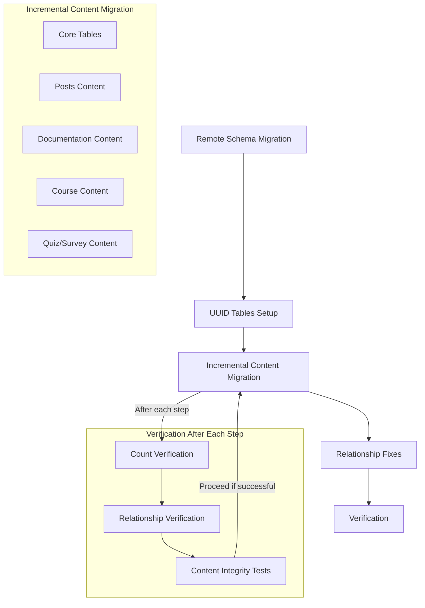

# Progressive Migration Implementation Plan

**Document Date:** April 15, 2025  
**Status:** Implementation Plan

## 1. Current Status Assessment

Based on a thorough analysis of the database schemas, migration scripts, logs, and current implementation, we have identified the following status:

### 1.1. What's Working

1. **Schema Migration**:

   - Database schema has been successfully migrated to the remote Supabase instance
   - All payload tables (47+) exist in the correct schema structure
   - Table relationships and constraints are properly defined

2. **UUID Tables Setup**:

   - The `dynamic_uuid_tables` tracking infrastructure is in place
   - Basic UUID table monitoring functionality is operational

3. **Remote Connection**:
   - Connection to the remote Supabase instance is established and functional
   - Authentication and permissions are configured correctly

### 1.2. What's Not Working

1. **Data Migration**:

   - Most tables exist but are empty or contain incomplete data
   - Posts table contains only 9 rows (verified)
   - Complex relationships are not fully established

2. **Progressive Migration**:

   - The progressive migration script exists but hasn't been tested effectively
   - Current implementation encounters errors during execution

3. **Relationship Handling**:
   - UUID table relationships are not properly maintained
   - Lexical format for rich text content may need repair
   - Downloads and media relationships are incomplete

## 2. Root Causes Identified

The root causes of the migration issues have been identified as follows:

### 2.1. Supabase CLI Limitations

1. **Dump Command Complexity**:

   - The `supabase db dump` command struggles with complex schemas
   - Large data sets cause memory and performance issues
   - Multi-table relationships require special ordering

2. **Shadow Database Creation**:

   - Shadow database creation issues during migration process
   - Version mismatches between local and remote Postgres instances
   - Configuration differences affecting migration outcomes

3. **Script Execution Environment**:
   - PowerShell script execution context limitations
   - Path and environment variable handling inconsistencies
   - Command-line parameter escaping issues

### 2.2. UUID Table Complexity

1. **Dynamic Table Creation**:

   - Payload CMS creates dynamic UUID-named tables for relationships
   - Tables are created with inconsistent column structures
   - Missing required columns (`path`, `id`) in UUID tables

2. **Type Consistency Issues**:

   - Type mismatches between UUID and TEXT types
   - Casting requirements not consistently applied
   - Relationship references using different data types

3. **Monitoring and Tracking**:
   - Dynamic table creation happens at runtime
   - Table creation events not consistently tracked
   - Proactive column addition mechanism needed

### 2.3. Migration Script Implementation

1. **Process Scope**:

   - Current master script attempts to handle too much at once
   - Lack of incremental process with verification steps
   - Insufficient error handling and recovery mechanisms

2. **Script Organization**:

   - Connection test scripts have redundancy and overlapping functionality
   - Unclear dependency management between script components
   - Inconsistent error handling approaches

3. **Verification Gaps**:
   - Limited verification between migration steps
   - Missing count and content validation
   - Insufficient reporting of migration status

## 3. Recommended Implementation Strategy

Based on our analysis, we recommend focusing on the progressive migration approach which is already partially implemented but needs refinement and debugging:



### 3.1. Implementation Phases

#### Phase 1: Test and Debug migrate-content-progressive.ps1

The `migrate-content-progressive.ps1` script provides a solid foundation for our implementation as it:

- Breaks down migration into logical content types
- Handles one table group at a time
- Includes relationship fixes specific to each content type
- Has built-in verification capabilities

Immediate action steps:

1. **Run Core Tables Only**:

   ```powershell
   ./supabase-remote-migration.ps1 -ProgressiveOnly -SkipDocumentation -SkipCourses -SkipQuizzes -SkipSurveys
   ```

2. **Verify Core Tables**:

   - Confirm users table has been populated
   - Verify media records exist and are accessible
   - Check payload_preferences and payload_migrations tables

3. **Debug Incrementally**:
   - Address any errors that occur during Core tables migration
   - Fix script issues before proceeding to content tables
   - Document solutions for each issue encountered

#### Phase 2: Script Improvements

The current script can be enhanced with the following improvements:

1. **Enhanced Error Handling**:

   - Add more granular transaction control
   - Implement robust error catching for each table
   - Create recovery points to resume from specific migration steps
   - Add detailed logging of each step's success/failure

2. **Enhanced Verification**:

   - Implement row count comparisons between local and remote
   - Add sample record verification for data integrity
   - Test relationship integrity with simple queries
   - Generate migration summary reports

3. **Optimized Data Transfer**:
   - Use smaller batch sizes for improved reliability
   - Implement retries with exponential backoff for failed operations
   - Consider direct PostgreSQL dump/restore for certain tables
   - Add checksum verification for critical content

#### Phase 3: Content Type Migration

Once the core functionality is working, proceed with content migration in this order:

1. **Posts Content**:

   ```powershell
   ./supabase-remote-migration.ps1 -ProgressiveOnly -SkipCore -SkipDocumentation -SkipCourses -SkipQuizzes -SkipSurveys
   ```

2. **Documentation Content**:

   ```powershell
   ./supabase-remote-migration.ps1 -ProgressiveOnly -SkipCore -SkipPosts -SkipCourses -SkipQuizzes -SkipSurveys
   ```

3. **Course Content**:

   ```powershell
   ./supabase-remote-migration.ps1 -ProgressiveOnly -SkipCore -SkipPosts -SkipDocumentation -SkipQuizzes -SkipSurveys
   ```

4. **Quiz and Survey Content**:
   ```powershell
   ./supabase-remote-migration.ps1 -ProgressiveOnly -SkipCore -SkipPosts -SkipDocumentation -SkipCourses
   ```

#### Phase 4: Final System Testing

After all data is migrated:

1. **Run Comprehensive Verification**:

   ```powershell
   ./supabase-remote-migration.ps1 -VerifyOnly
   ```

2. **Perform Application Testing**:

   - Configure the application to connect to the remote database
   - Test critical features and user journeys
   - Verify media and download functionality

3. **Deploy Final Configuration**:
   - Update environment variables for production deployment
   - Configure monitoring for the remote database
   - Document the migration completion

## 4. Specific Technical Recommendations

### 4.1. Schema and Table Creation

1. **Fix CREATE TABLE Issues**:

   ```powershell
   # Add to migrate-content-progressive.ps1 - handle existing tables
   try {
       Invoke-RemoteSql "DROP TABLE IF EXISTS payload.$table CASCADE;"
       Invoke-RemoteSql "CREATE TABLE payload.$table (...);"
   }
   catch {
       Log-Warning "Error creating table: $_"
       # Attempt to continue with the migration
   }
   ```

2. **Transaction Management**:

   ```powershell
   # Improve transaction handling in SQL
   Add-Content -Path $combinedDumpFile -Value "BEGIN;"
   Add-Content -Path $combinedDumpFile -Value "SET LOCAL statement_timeout = '300s';"
   Add-Content -Path $combinedDumpFile -Value "SET LOCAL lock_timeout = '30s';"
   # ... SQL content ...
   Add-Content -Path $combinedDumpFile -Value "COMMIT;"
   ```

3. **Table Dependency Order**:
   - Ensure tables are created and populated in the correct order
   - Handle foreign key constraints appropriately
   - Consider temporarily disabling triggers during migration

### 4.2. UUID Table Handling

1. **Proactive UUID Table Monitoring**:

   ```powershell
   # Scan for UUID tables and ensure columns exist
   Invoke-RemoteSql @"
   DO \$\$
   DECLARE
     r RECORD;
     uuid_pattern TEXT := '^[0-9a-f]{8}_[0-9a-f]{4}_[0-9a-f]{4}_[0-9a-f]{4}_[0-9a-f]{12}\$';
   BEGIN
     FOR r IN
       SELECT table_name
       FROM information_schema.tables
       WHERE table_schema = 'payload'
       AND table_name ~ uuid_pattern
     LOOP
       -- Insert into tracking table if not exists
       INSERT INTO payload.dynamic_uuid_tables (table_name)
       VALUES (r.table_name)
       ON CONFLICT (table_name) DO NOTHING;

       -- Ensure path column exists
       PERFORM payload.ensure_uuid_table_columns(r.table_name);
     END LOOP;
   END;
   \$\$;
   "@
   ```

2. **Column Addition Function**:
   ```powershell
   # Ensure this function exists on the remote database
   Invoke-RemoteSql @"
   CREATE OR REPLACE FUNCTION payload.ensure_uuid_table_columns(table_name TEXT)
   RETURNS VOID AS \$\$
   DECLARE
     column_exists BOOLEAN;
   BEGIN
     -- Check if path column exists
     SELECT EXISTS (
       SELECT 1
       FROM information_schema.columns
       WHERE table_schema = 'payload'
       AND table_name = ensure_uuid_table_columns.table_name
       AND column_name = 'path'
     ) INTO column_exists;

     -- Add path column if it doesn't exist
     IF NOT column_exists THEN
       EXECUTE format('ALTER TABLE payload.%I ADD COLUMN path TEXT', table_name);
     END IF;

     -- Check if id column exists
     SELECT EXISTS (
       SELECT 1
       FROM information_schema.columns
       WHERE table_schema = 'payload'
       AND table_name = ensure_uuid_table_columns.table_name
       AND column_name = 'id'
     ) INTO column_exists;

     -- Add id column if it doesn't exist
     IF NOT column_exists THEN
       EXECUTE format('ALTER TABLE payload.%I ADD COLUMN id TEXT', table_name);
     END IF;
   END;
   \$\$ LANGUAGE plpgsql;
   "@
   ```

### 4.3. Lexical Format Handling

1. **Format Verification**:

   ```powershell
   # Add to the content verification step
   Invoke-RemoteSql @"
   SELECT COUNT(*)
   FROM payload.posts
   WHERE content IS NOT NULL
   AND (jsonb_typeof(content) != 'array'
        OR jsonb_array_length(content) = 0);
   "@
   ```

2. **Format Correction**:
   ```powershell
   # Ensure content is properly formatted
   Exec-Command -command "pnpm --filter @kit/content-migrations run fix:lexical-format -- --collection posts" -description "Fixing Lexical format for posts"
   Exec-Command -command "pnpm --filter @kit/content-migrations run fix:lexical-format -- --collection documentation" -description "Fixing Lexical format for documentation"
   ```

### 4.4. Failure Recovery

1. **Checkpointing**:

   ```powershell
   # Add checkpoint recording to the script
   function Record-Checkpoint {
       param (
           [string]$PhaseName,
           [string]$TableName,
           [string]$Status
       )

       $checkpointFile = Join-Path -Path $env:TEMP -ChildPath "migration_checkpoint.json"
       $checkpoint = @{
           Timestamp = Get-Date -Format "yyyy-MM-dd HH:mm:ss"
           Phase = $PhaseName
           Table = $TableName
           Status = $Status
       }

       if (Test-Path $checkpointFile) {
           $checkpoints = Get-Content -Path $checkpointFile -Raw | ConvertFrom-Json
       } else {
           $checkpoints = @()
       }

       $checkpoints += $checkpoint
       $checkpoints | ConvertTo-Json | Set-Content -Path $checkpointFile
   }
   ```

2. **Resume Capability**:
   ```powershell
   # Add resume capability to the script
   function Should-Skip {
       param (
           [string]$PhaseName,
           [string]$TableName
       )

       $checkpointFile = Join-Path -Path $env:TEMP -ChildPath "migration_checkpoint.json"
       if (-not (Test-Path $checkpointFile)) { return $false }

       $checkpoints = Get-Content -Path $checkpointFile -Raw | ConvertFrom-Json
       foreach ($checkpoint in $checkpoints) {
           if ($checkpoint.Phase -eq $PhaseName -and $checkpoint.Table -eq $TableName -and $checkpoint.Status -eq "Success") {
               return $true
           }
       }

       return $false
   }
   ```

## 5. Testing Sequence

### 5.1. Core Tables Testing

1. **Pre-Migration Verification**:

   - Verify remote connection is working
   - Confirm schema exists
   - Check UUID table tracking infrastructure

2. **Migration Steps**:

   - Run core tables migration only
   - Monitor for any errors
   - Fix issues as they arise

3. **Post-Migration Verification**:
   - Count rows in core tables
   - Verify sample records
   - Check table structures

### 5.2. Posts Content Testing

1. **Pre-Migration Verification**:

   - Verify core tables migration was successful
   - Check posts table structure

2. **Migration Steps**:

   - Run posts content migration only
   - Monitor for lexical format issues
   - Check for relationship errors

3. **Post-Migration Verification**:
   - Count rows in posts-related tables
   - Verify relationship tables
   - Check post content for proper formatting

### 5.3. Documentation Content Testing

1. **Pre-Migration Verification**:

   - Verify previous migrations were successful
   - Check documentation table structure

2. **Migration Steps**:

   - Run documentation content migration only
   - Monitor for breadcrumb relationship issues
   - Check for category and tag relationships

3. **Post-Migration Verification**:
   - Count rows in documentation-related tables
   - Verify breadcrumb structure
   - Check documentation content formatting

### 5.4. Course Content Testing

1. **Pre-Migration Verification**:

   - Verify previous migrations were successful
   - Check course-related table structures

2. **Migration Steps**:

   - Run course content migration only
   - Monitor for lesson-quiz relationships
   - Check for download relationships

3. **Post-Migration Verification**:
   - Count rows in course-related tables
   - Verify lesson ordering
   - Check course content formatting

### 5.5. Quiz and Survey Testing

1. **Pre-Migration Verification**:

   - Verify previous migrations were successful
   - Check quiz and survey table structures

2. **Migration Steps**:

   - Run quiz and survey content migration only
   - Monitor for question-option relationships
   - Check for survey question formatting

3. **Post-Migration Verification**:
   - Count rows in quiz and survey tables
   - Verify option structures
   - Check question formatting

### 5.6. Comprehensive Testing

1. **Row Count Comparison**:

   - Compare row counts between local and remote databases
   - Generate discrepancy report
   - Address any missing data

2. **Relationship Verification**:

   - Test key relationships between content types
   - Verify UUID relationships
   - Test complex queries that span multiple tables

3. **Application Testing**:
   - Configure application to use remote database
   - Test core functionality
   - Verify media and download access

## 6. Success Criteria

The migration will be considered successful when:

1. **Data Completeness**:

   - All tables from local database exist in remote database
   - Row counts match between local and remote
   - Sample content verification passes

2. **Relationship Integrity**:

   - All relationships between content types are maintained
   - UUID tables have proper columns and structure
   - Complex queries return expected results

3. **Application Functionality**:

   - Application runs correctly against remote database
   - Media and downloads are accessible
   - Course navigation and progression work properly

4. **Performance**:
   - Database queries perform within acceptable thresholds
   - No timeout issues during normal operation
   - Connection pooling functions properly

## 7. Conclusion

This progressive migration implementation plan addresses the key challenges identified in the current migration process. By breaking down the process into smaller, manageable steps with comprehensive verification at each stage, we can ensure a reliable migration of all content to the remote Supabase instance.

The plan leverages the existing `migrate-content-progressive.ps1` script as a foundation, enhancing it with improved error handling, transaction management, and verification steps. This approach will provide a more robust and reliable migration process with clear visibility into progress and issues.

Upon successful implementation, the remote Supabase instance will contain a complete copy of the local database with all relationships and content integrity maintained, ready for production use.
