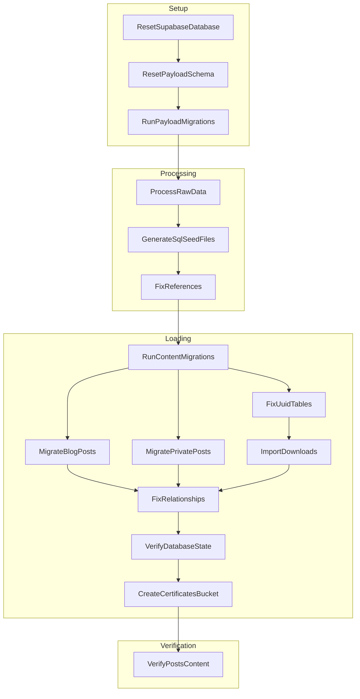

# Content Migration System Optimization Plan

## 1. Overview

This document outlines a comprehensive plan to optimize the content migration system by addressing non-critical errors, restructuring the verification sequence, enhancing logging, and adding a dependency graph to enable parallel execution where possible.

## 2. Current Issues

Based on analysis of the migration logs and the reset-and-migrate.ps1 script, the following issues have been identified:

### 2.1. Non-Critical Errors

1. **PNPM Configuration Warning**:

   ```
   WARNING The field "pnpm.onlyBuiltDependencies" was found in D:\SlideHeroes\App\repos\2025slideheroes\apps\payload/package.json. This will not take effect.
   ```

   Root cause: Configuration is in the wrong location (should be at workspace root).

2. **No Email Adapter Warning**:

   ```
   WARN: No email adapter provided. Email will be written to console.
   ```

   Root cause: Expected behavior in development, but creates noise in logs.

3. **Todo Fields Verification Failure**:
   ```
   Verification FAILED: 95 fields are missing
   Database connection closed
   ❌ Todo fields verification failed
   ```
   Root cause: Verification runs before fix scripts, leading to expected but confusing "failures".

### 2.2. Structural Inefficiencies

1. **Sequential Verification**: Verification runs before fixes, then fixes are applied, then verification runs again.
2. **Limited Parallelization**: Some independent operations could potentially run in parallel.
3. **Basic Logging**: Current logging doesn't provide performance metrics or clear progress indicators.
4. **No Explicit Dependency Tracking**: Steps are executed in sequence without explicit dependency modeling.

## 3. Implementation Plan

### 3.1. Fix Non-Critical Errors

#### 3.1.1. PNPM Configuration Fix

Create a utility function to move the PNPM configuration from the Payload package.json to the root package.json:

```powershell
function Move-PnpmConfiguration {
    Log-Step "Moving pnpm.onlyBuiltDependencies configuration to root package.json" 0

    # Read payload package.json
    $payloadPackageJsonPath = Join-Path -Path (Get-Location) -ChildPath "apps/payload/package.json"
    $rootPackageJsonPath = Join-Path -Path (Get-Location) -ChildPath "package.json"

    if (Test-Path -Path $payloadPackageJsonPath) {
        $payloadPackageJson = Get-Content -Path $payloadPackageJsonPath -Raw | ConvertFrom-Json
        $rootPackageJson = Get-Content -Path $rootPackageJsonPath -Raw | ConvertFrom-Json

        # Check if the payload package.json has pnpm configuration
        if ($payloadPackageJson.pnpm -and $payloadPackageJson.pnpm.onlyBuiltDependencies) {
            Log-Message "Found pnpm.onlyBuiltDependencies in payload package.json" "Yellow"

            # Add or update pnpm configuration in root package.json
            if (-not $rootPackageJson.pnpm) {
                $rootPackageJson | Add-Member -NotePropertyName "pnpm" -NotePropertyValue @{}
            }

            $rootPackageJson.pnpm | Add-Member -NotePropertyName "onlyBuiltDependencies" -NotePropertyValue $payloadPackageJson.pnpm.onlyBuiltDependencies -Force

            # Save updated root package.json
            $rootPackageJson | ConvertTo-Json -Depth 10 | Set-Content -Path $rootPackageJsonPath

            # Remove pnpm configuration from payload package.json
            $payloadPackageJson.pnpm.PSObject.Properties.Remove("onlyBuiltDependencies")

            # If pnpm object is now empty, remove it
            if ($payloadPackageJson.pnpm.PSObject.Properties.Count -eq 0) {
                $payloadPackageJson.PSObject.Properties.Remove("pnpm")
            }

            # Save updated payload package.json
            $payloadPackageJson | ConvertTo-Json -Depth 10 | Set-Content -Path $payloadPackageJsonPath

            Log-Success "Moved pnpm.onlyBuiltDependencies configuration to root package.json"
        }
    }
}
```

#### 3.1.2. Email Adapter Warning Fix

Add a note in the setup phase to acknowledge this expected warning:

```powershell
# Add to Run-PayloadMigrations in scripts/orchestration/phases/setup.ps1
Log-Message "Note: 'No email adapter provided' warning is expected in development environment" "Yellow"
```

#### 3.1.3. Todo Fields Verification Fix

This will be addressed by the verification sequence restructuring in section 3.2.

### 3.2. Restructure Verification Sequence

Create a verification dependencies framework that ensures fixes are applied before final verification:

#### 3.2.1. Verification Dependencies Module

Create a new file `scripts/orchestration/utils/verification-dependencies.ps1`:

```powershell
# Initialize global verification dependency mapping
$global:verificationDependencies = @{
    "todo_fields" = @{
        "fixFunctions" = @("Fix-TodoFields", "Fix-LexicalFormat")
        "verifyFunction" = "Verify-TodoFields"
        "fixed" = $false
    }
    "quiz_relationships" = @{
        "fixFunctions" = @("Fix-QuizRelationships", "Fix-QuizQuestionRelationships")
        "verifyFunction" = "Verify-QuizRelationships"
        "fixed" = $false
    }
    "uuid_tables" = @{
        "fixFunctions" = @("Fix-UuidTables", "Repair-RelationshipColumns")
        "verifyFunction" = "Verify-UuidTables"
        "fixed" = $false
    }
    "post_content" = @{
        "fixFunctions" = @("Fix-PostLexicalFormat", "Fix-PostImageRelationships")
        "verifyFunction" = "Verify-PostContent"
        "fixed" = $false
    }
}

# Function to run fixes and verification in the correct order
function Invoke-FixAndVerify {
    param (
        [string]$EntityType,
        [switch]$SkipVerificationIfFixed
    )

    if (-not $global:verificationDependencies.ContainsKey($EntityType)) {
        Log-Warning "Unknown entity type for verification: $EntityType"
        return $false
    }

    $entity = $global:verificationDependencies[$EntityType]

    # If already fixed and we can skip verification, return
    if ($entity.fixed -and $SkipVerificationIfFixed) {
        Log-Message "Skipping verification for $EntityType (already fixed)" "Gray"
        return $true
    }

    # First run the verification to check if fixing is needed
    Log-Message "Verifying $EntityType..." "Yellow"
    $verificationResult = & $entity.verifyFunction

    if ($verificationResult) {
        Log-Success "$EntityType verification passed"
        $entity.fixed = $true
        return $true
    }

    # If verification failed, run the fix functions
    Log-Message "$EntityType verification failed. Running fixes..." "Yellow"

    foreach ($fixFunction in $entity.fixFunctions) {
        Log-Message "Running $fixFunction..." "Yellow"
        $fixResult = & $fixFunction

        if (-not $fixResult) {
            Log-Warning "$fixFunction did not complete successfully"
        }
    }

    # Run verification again after fixes
    Log-Message "Verifying $EntityType after fixes..." "Yellow"
    $verificationResult = & $entity.verifyFunction

    if ($verificationResult) {
        Log-Success "$EntityType fixed and verified successfully"
        $entity.fixed = $true
        return $true
    } else {
        Log-Warning "$EntityType could not be completely fixed"
        return $false
    }
}
```

#### 3.2.2. Update Fix-Relationships Function

Update the existing function to use the new verification dependency framework:

```powershell
function Fix-Relationships {
    Log-Step "Fixing relationships" 9

    try {
        # First ensure we're at the project root
        Set-ProjectRootLocation

        # Navigate to content-migrations directory
        if (Set-ProjectLocation -RelativePath "packages/content-migrations") {
            # Use the new dependency-based verification approach
            Invoke-FixAndVerify -EntityType "todo_fields"
            Invoke-FixAndVerify -EntityType "quiz_relationships"
            Invoke-FixAndVerify -EntityType "uuid_tables"
            Invoke-FixAndVerify -EntityType "post_content"

            # Additional custom fixes that don't fit the pattern
            Log-Message "Running edge case repairs..." "Yellow"
            Exec-Command -command "pnpm run repair:edge-cases" -description "Running edge case repairs" -continueOnError

            # ... other existing fixes as needed ...

            # Final verification after all fixes
            Log-Message "Running final comprehensive verification..." "Yellow"
            $finalVerification = Exec-Command -command "pnpm run verify:all" -description "Final verification" -captureOutput -continueOnError

            if ($finalVerification -match "Warning" -or $finalVerification -match "Error") {
                Log-Warning "Some issues could not be fixed automatically"
            } else {
                Log-Success "All relationship issues have been fixed"
            }

            Pop-Location
        }

        return $true
    }
    catch {
        Log-Error "Failed to fix relationships: $_"
        throw "Relationship fixing failed: $_"
    }
}
```

#### 3.2.3. Update Verify-DatabaseState Function

Update to only run verification for items not already fixed:

```powershell
function Verify-DatabaseState {
    # Only run verifications for items not already fixed and verified
    $items = @("todo_fields", "quiz_relationships", "uuid_tables", "post_content")
    $allPassed = $true

    foreach ($item in $items) {
        if (-not $global:verificationDependencies[$item].fixed) {
            $result = Invoke-FixAndVerify -EntityType $item
            $allPassed = $allPassed -and $result
        }
    }

    # Final schema verification
    Log-Message "Performing final database schema verification..." "Yellow"
    $schemaVerification = Exec-Command -command "pnpm run sql:verify-schema" -description "Final database verification" -captureOutput -continueOnError

    if ($schemaVerification -match "Error" -or $LASTEXITCODE -ne 0) {
        Log-Error "Final database verification failed"
        $allPassed = $false
    }

    if ($allPassed) {
        Log-Success "Database verification completed successfully"
    } else {
        Log-Warning "Database verification completed with warnings"
    }

    return $allPassed
}
```

### 3.3. Enhance Logging

#### 3.3.1. Performance Logging Module

Create a new file `scripts/orchestration/utils/performance-logging.ps1`:

```powershell
# Track execution time for different phases and steps
$global:executionTiming = @{
    "PhaseTimings" = @{}
    "StepTimings" = @{}
    "StartTime" = $null
    "TotalTime" = $null
}

function Start-PhaseTimer {
    param (
        [string]$PhaseName
    )

    $global:executionTiming.PhaseTimings[$PhaseName] = @{
        "StartTime" = Get-Date
        "EndTime" = $null
        "Duration" = $null
    }
}

function Stop-PhaseTimer {
    param (
        [string]$PhaseName
    )

    if ($global:executionTiming.PhaseTimings.ContainsKey($PhaseName)) {
        $phase = $global:executionTiming.PhaseTimings[$PhaseName]
        $phase.EndTime = Get-Date
        $phase.Duration = $phase.EndTime - $phase.StartTime
    }
}

function Start-StepTimer {
    param (
        [string]$StepName
    )

    $global:executionTiming.StepTimings[$StepName] = @{
        "StartTime" = Get-Date
        "EndTime" = $null
        "Duration" = $null
    }
}

function Stop-StepTimer {
    param (
        [string]$StepName
    )

    if ($global:executionTiming.StepTimings.ContainsKey($StepName)) {
        $step = $global:executionTiming.StepTimings[$StepName]
        $step.EndTime = Get-Date
        $step.Duration = $step.EndTime - $step.StartTime
    }
}

function Initialize-Timer {
    $global:executionTiming.StartTime = Get-Date
}

function Finalize-Timer {
    $global:executionTiming.TotalTime = (Get-Date) - $global:executionTiming.StartTime
}

function Show-PerformanceReport {
    $totalSeconds = $global:executionTiming.TotalTime.TotalSeconds

    Write-Host "=== Performance Report ===" -ForegroundColor Cyan
    Write-Host "Total execution time: $([math]::Round($totalSeconds, 2)) seconds" -ForegroundColor Cyan

    Write-Host "`nPhase Timings:" -ForegroundColor Cyan
    $global:executionTiming.PhaseTimings.GetEnumerator() | Sort-Object { $_.Value.StartTime } | ForEach-Object {
        $duration = if ($_.Value.Duration) { $_.Value.Duration.TotalSeconds } else { "N/A" }
        $percentage = if ($duration -ne "N/A") { [math]::Round(($duration / $totalSeconds) * 100, 1) } else { "N/A" }

        Write-Host "  $($_.Key): $([math]::Round($duration, 2)) seconds ($percentage%)" -ForegroundColor White
    }

    Write-Host "`nTop 5 Longest Steps:" -ForegroundColor Cyan
    $global:executionTiming.StepTimings.GetEnumerator() |
        Where-Object { $_.Value.Duration } |
        Sort-Object { $_.Value.Duration.TotalSeconds } -Descending |
        Select-Object -First 5 |
        ForEach-Object {
            $duration = $_.Value.Duration.TotalSeconds
            $percentage = [math]::Round(($duration / $totalSeconds) * 100, 1)

            Write-Host "  $($_.Key): $([math]::Round($duration, 2)) seconds ($percentage%)" -ForegroundColor White
        }
}
```

#### 3.3.2. Progress Bar Visualization

Add to enhanced-logging.ps1:

```powershell
function Show-ProgressBar {
    param (
        [int]$Current,
        [int]$Total,
        [string]$Activity,
        [int]$BarLength = 50
    )

    $percentComplete = [math]::Min(100, [math]::Round(($Current / $Total) * 100, 0))
    $completedLength = [math]::Round(($percentComplete / 100) * $BarLength)
    $remainingLength = $BarLength - $completedLength

    $progressBar = "[" + "=".PadRight($completedLength, "=") + " ".PadRight($remainingLength, " ") + "]"

    Write-Host "`r$Activity: $progressBar $percentComplete% ($Current/$Total)" -NoNewline

    if ($Current -eq $Total) {
        Write-Host ""
    }
}
```

#### 3.3.3. Enhanced Log-Step Function

Update the existing function to track timing:

```powershell
function Log-Step {
    param (
        [string]$StepName,
        [int]$StepNumber = 0,
        [int]$TotalSteps = 12
    )

    $progressText = if ($StepNumber -gt 0) { "[$StepNumber/$TotalSteps] " } else { "" }
    $lineLength = 60

    # Start timing this step
    Start-StepTimer -StepName "$StepNumber-$StepName"

    # Visual display
    Write-Host ""
    Write-Host "+" -ForegroundColor Cyan -NoNewline
    Write-Host "-".PadRight($lineLength - 2, "-") -ForegroundColor Cyan -NoNewline
    Write-Host "+" -ForegroundColor Cyan

    Write-Host "|" -ForegroundColor Cyan -NoNewline
    Write-Host " $progressText$StepName" -ForegroundColor Yellow -NoNewline
    $paddingRight = $lineLength - 3 - "$progressText$StepName".Length
    Write-Host " ".PadRight($paddingRight) -NoNewline
    Write-Host "|" -ForegroundColor Cyan

    Write-Host "+" -ForegroundColor Cyan -NoNewline
    Write-Host "-".PadRight($lineLength - 2, "-") -ForegroundColor Cyan -NoNewline
    Write-Host "+" -ForegroundColor Cyan

    # Create detailed log entry with status tracking
    $timestamp = (Get-Date).ToString("yyyy-MM-dd HH:mm:ss")
    Add-Content -Path $script:detailedLogFile -Value "`n$timestamp - ------------------------------------------------------------"
    Add-Content -Path $script:detailedLogFile -Value "$timestamp - STEP $StepNumber`: $StepName [STARTED]"
    Add-Content -Path $script:detailedLogFile -Value "$timestamp - ------------------------------------------------------------"

    # Update global step tracking
    $global:currentStep = $StepNumber
    $global:currentStepName = $StepName

    if ($StepNumber -gt 0 -and $TotalSteps -gt 0) {
        Show-ProgressBar -Current $StepNumber -Total $TotalSteps -Activity "Migration Progress"
    }
}

function Log-StepCompletion {
    param (
        [bool]$Success = $true
    )

    # Stop timing this step
    Stop-StepTimer -StepName "$global:currentStep-$global:currentStepName"

    # Create detailed log entry with status tracking
    $timestamp = (Get-Date).ToString("yyyy-MM-dd HH:mm:ss")
    $status = if ($Success) { "COMPLETED" } else { "FAILED" }
    Add-Content -Path $script:detailedLogFile -Value "$timestamp - STEP $global:currentStep`: $global:currentStepName [$status]"

    # Add timing information
    $stepTime = $global:executionTiming.StepTimings["$global:currentStep-$global:currentStepName"].Duration.TotalSeconds
    Add-Content -Path $script:detailedLogFile -Value "$timestamp - Step duration: $([math]::Round($stepTime, 2)) seconds"

    # Log success/failure
    if ($Success) {
        Log-Success "Step $global:currentStep completed successfully (${stepTime}s)"
    }
    else {
        Log-Warning "Step $global:currentStep completed with warnings or errors (${stepTime}s)"
    }
}
```

### 3.4. Add Dependency Graph for Steps

#### 3.4.1. Step Dependency Graph Module

Create a new file `scripts/orchestration/utils/dependency-graph.ps1`:

```powershell
# Define the step dependency graph
$global:stepDependencies = @{
    # Setup Phase
    "ResetSupabaseDatabase" = @{
        "Id" = 1
        "Phase" = "Setup"
        "Dependencies" = @()
        "Function" = "Reset-SupabaseDatabase"
        "Parallel" = $false
    }
    "ResetPayloadSchema" = @{
        "Id" = 2
        "Phase" = "Setup"
        "Dependencies" = @("ResetSupabaseDatabase")
        "Function" = "Reset-PayloadSchema"
        "Parallel" = $false
    }
    "RunPayloadMigrations" = @{
        "Id" = 3
        "Phase" = "Setup"
        "Dependencies" = @("ResetPayloadSchema")
        "Function" = "Run-PayloadMigrations"
        "Parallel" = $false
    }

    # Processing Phase
    "ProcessRawData" = @{
        "Id" = 4
        "Phase" = "Processing"
        "Dependencies" = @("RunPayloadMigrations")
        "Function" = "Process-RawData"
        "Parallel" = $false
    }
    "GenerateSqlSeedFiles" = @{
        "Id" = 5
        "Phase" = "Processing"
        "Dependencies" = @("ProcessRawData")
        "Function" = "Generate-SqlSeedFiles"
        "Parallel" = $false
    }
    "FixReferences" = @{
        "Id" = 6
        "Phase" = "Processing"
        "Dependencies" = @("GenerateSqlSeedFiles")
        "Function" = "Fix-References"
        "Parallel" = $false
    }

    # Loading Phase
    "RunContentMigrations" = @{
        "Id" = 7
        "Phase" = "Loading"
        "Dependencies" = @("FixReferences")
        "Function" = "Run-ContentMigrations"
        "Parallel" = $false
    }
    "MigrateBlogPosts" = @{
        "Id" = 7.5
        "Phase" = "Loading"
        "Dependencies" = @("RunContentMigrations")
        "Function" = "Migrate-BlogPosts"
        "Parallel" = $true  # Can potentially run in parallel with others
    }
    "MigratePrivatePosts" = @{
        "Id" = 7.6
        "Phase" = "Loading"
        "Dependencies" = @("RunContentMigrations")
        "Function" = "Migrate-PrivatePosts"
        "Parallel" = $true  # Can potentially run in parallel with others
    }
    "FixUuidTables" = @{
        "Id" = 7.7
        "Phase" = "Loading"
        "Dependencies" = @("RunContentMigrations")
        "Function" = "Fix-UuidTables"
        "Parallel" = $true  # Can potentially run in parallel with others
    }
    "ImportDownloads" = @{
        "Id" = 8
        "Phase" = "Loading"
        "Dependencies" = @("RunContentMigrations", "FixUuidTables")
        "Function" = "Import-Downloads"
        "Parallel" = $false  # Better to run sequentially due to potential conflicts
    }
    "FixRelationships" = @{
        "Id" = 9
        "Phase" = "Loading"
        "Dependencies" = @("MigrateBlogPosts", "MigratePrivatePosts", "ImportDownloads")
        "Function" = "Fix-Relationships"
        "Parallel" = $false
    }
    "VerifyDatabaseState" = @{
        "Id" = 10
        "Phase" = "Loading"
        "Dependencies" = @("FixRelationships")
        "Function" = "Verify-DatabaseState"
        "Parallel" = $false
    }
    "CreateCertificatesBucket" = @{
        "Id" = 11
        "Phase" = "Loading"
        "Dependencies" = @("VerifyDatabaseState")
        "Function" = "Create-CertificatesBucket"
        "Parallel" = $false
    }

    # Verification Phase
    "VerifyPostsContent" = @{
        "Id" = 12
        "Phase" = "Verification"
        "Dependencies" = @("CreateCertificatesBucket")
        "Function" = "Verify-PostsContent"
        "Parallel" = $false
    }
}

function Get-StepByID {
    param (
        [int]$ID
    )

    foreach ($step in $global:stepDependencies.GetEnumerator()) {
        if ($step.Value.Id -eq $ID) {
            return $step.Key
        }
    }

    return $null
}

function Get-DependenciesForStep {
    param (
        [string]$StepName
    )

    if (-not $global:stepDependencies.ContainsKey($StepName)) {
        Log-Warning "Step '$StepName' not found in dependency graph"
        return @()
    }

    return $global:stepDependencies[$StepName].Dependencies
}

function Get-ParallelizableSteps {
    $parallelizableSteps = @{}

    foreach ($step in $global:stepDependencies.GetEnumerator()) {
        if ($step.Value.Parallel) {
            $parallelizableSteps[$step.Key] = $step.Value
        }
    }

    return $parallelizableSteps
}

function Show-DependencyGraph {
    $mermaidGraph = @"
graph TD;
"@

    foreach ($step in $global:stepDependencies.GetEnumerator()) {
        $stepName = $step.Key
        $dependencies = $step.Value.Dependencies

        if ($dependencies.Count -eq 0) {
            $mermaidGraph += "`n    $stepName;"
        } else {
            foreach ($dep in $dependencies) {
                $mermaidGraph += "`n    $dep --> $stepName;"
            }
        }
    }

    # Group by phase
    foreach ($phase in @("Setup", "Processing", "Loading", "Verification")) {
        $mermaidGraph += "`n    subgraph $phase"

        foreach ($step in $global:stepDependencies.GetEnumerator()) {
            if ($step.Value.Phase -eq $phase) {
                $mermaidGraph += "`n        $($step.Key);"
            }
        }

        $mermaidGraph += "`n    end"
    }

    Log-Message "Dependency Graph (Mermaid Format):" "Cyan"
    Write-Host $mermaidGraph
}

# This function would be used in a future implementation for true parallelization
function Invoke-ParallelSteps {
    param (
        [string[]]$Steps,
        [hashtable]$Parameters
    )

    # Currently runs sequentially but logs that they could be parallelized
    $results = @{}

    foreach ($step in $Steps) {
        Log-Message "Running step '$step' (could be parallelized)" "Magenta"

        $functionName = $global:stepDependencies[$step].Function
        $stepParams = $Parameters[$step] ? $Parameters[$step] : @{}

        $results[$step] = & $functionName @stepParams
    }

    return $results
}
```

#### 3.4.2. Update Main Script to Use Dependency Graph

Modify the main `reset-and-migrate.ps1` script to:

```powershell
# Add imports for new modules
. "$PSScriptRoot\scripts\orchestration\utils\performance-logging.ps1"
. "$PSScriptRoot\scripts\orchestration\utils\dependency-graph.ps1"
. "$PSScriptRoot\scripts\orchestration\utils\verification-dependencies.ps1"

# In the main try block, after Initialize-Logging:
Initialize-Timer

# At the end of the script, before Finalize-Logging:
Finalize-Timer
Show-PerformanceReport
```

#### 3.4.3. Update Phase Invocation Functions

Update each phase invocation method:

```powershell
function Invoke-LoadingPhase {
    param (
        [switch]$SkipVerification
    )

    Log-Phase "LOADING PHASE" 3 4
    Start-PhaseTimer -PhaseName "Loading"

    # Execute steps according to dependencies
    Run-ContentMigrations

    # These steps could potentially run in parallel
    $parallelSteps = @("MigrateBlogPosts", "MigratePrivatePosts", "FixUuidTables")
    $parallelParams = @{
        "MigrateBlogPosts" = @{}
        "MigratePrivatePosts" = @{}
        "FixUuidTables" = @{}
    }

    # In the future, this could use actual parallelization
    # For now, it's sequential but logged as potentially parallel
    Invoke-ParallelSteps -Steps $parallelSteps -Parameters $parallelParams

    # Continue with sequential steps
    Import-Downloads
    Fix-Relationships

    if (-not $SkipVerification) {
        Verify-DatabaseState
    }

    Create-CertificatesBucket

    Log-Success "Loading phase completed successfully"
    Stop-PhaseTimer -PhaseName "Loading"
}
```

## 4. Implementation Strategy

### 4.1. Phase-based Implementation

The implementation will be broken down into discrete phases:

1. **Phase 1: Fix Non-Critical Errors**

   - Create the Move-PnpmConfiguration function
   - Add the note about email adapter warnings

2. **Phase 2: Enhanced Logging**

   - Implement performance logging module
   - Add progress bar visualization
   - Update logging functions for timing

3. **Phase 3: Verification Restructuring**

   - Create verification dependencies framework
   - Update Fix-Relationships to use new dependencies
   - Update verification flow to run fix then verify

4. **Phase 4: Dependency Graph**
   - Create dependency graph module
   - Add parallel step identification
   - Update phase invocation to use dependency graph

### 4.2. Testing Approach

Each phase should be tested independently:

1. **Isolated Testing**

   - Test each new module individually
   - Validate logging output for better visibility

2. **Integration Testing**

   - Test the full migration process with new components
   - Verify output, timing, and error handling

3. **Performance Benchmarking**
   - Compare execution times before and after optimization
   - Identify additional optimization opportunities

### 4.3. Backward Compatibility

The implementation is designed to maintain backward compatibility:

1. **Graceful Degradation**

   - New features fail gracefully if dependencies aren't available
   - Default to existing behavior when new components aren't available

2. **Optional Features**
   - Timing and dependency features are optional enhancements
   - Core functionality continues to work if advanced features fail

## 5. Expected Benefits

### 5.1. Cleaner Logs

- More structured log output
- Clear indication of success/failure
- Timing information for performance analysis

### 5.2. Faster Execution

- Potentially parallel execution of compatible steps
- Reduced redundant verification
- Optimized fix-then-verify sequence

### 5.3. Better Diagnostics

- Performance metrics for optimization
- Clear visibility into bottlenecks
- Dependency visualization for understanding

### 5.4. Future Extensibility

- Framework for true parallel execution
- Easier addition of new components
- Better modularization of the system

## 6. Dependency Graph Visualization


