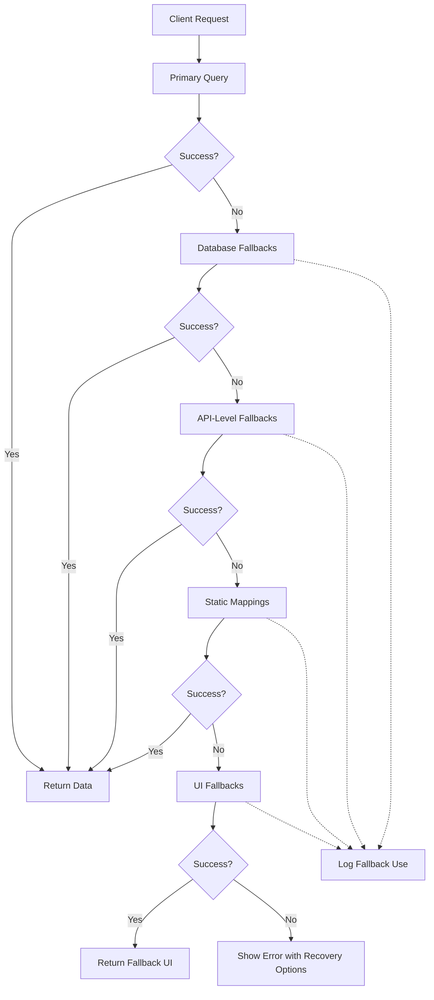

# Phase 4: Enhanced Fallback Mechanisms Implementation Plan

## Overview

Phase 4 builds on the previous phases of our comprehensive Payload CMS content fix plan:

1. ✅ **Phase 1**: Enhanced UUID Table Management
2. ✅ **Phase 2**: Comprehensive Relationship Repair
3. ✅ **Phase 3**: Fix S3 Storage Issues
4. 🔄 **Phase 4**: Enhanced Fallback Mechanisms (This Plan)

The purpose of Phase 4 is to implement a multi-layered fallback system that ensures content remains accessible even when primary access methods fail. This system will provide graceful degradation rather than abrupt errors, improving both admin and end-user experience.

## Objectives

1. Create a multi-tier database fallback system for relationship access
2. Implement Payload API-level fallbacks to handle data access errors
3. Develop UI components for graceful error handling in the admin interface
4. Integrate fallback mechanisms into the frontend for end users
5. Create comprehensive logging and monitoring for the fallback system

## System Architecture

The fallback system is designed as a series of progressive layers, each providing an alternative method to access content when primary methods fail:



## Implementation Plan Summary

This implementation plan is divided into four key parts:

1. **Database-Level Fallbacks**: Create robust database views, functions, and static mappings to ensure relationship data can be retrieved through multiple pathways
2. **Payload API-Level Fallbacks**: Implement hooks and API endpoints to automatically handle relationship errors
3. **UI-Level Fallbacks**: Create React components for graceful error handling in both admin and frontend UIs
4. **Integration & Verification**: Integrate with content migration system and add monitoring

Each part builds on the previous ones to create a comprehensive failsafe system.

## Detailed Implementation Steps

### 1. Database-Level Fallbacks

These fallbacks provide the foundation of the system by ensuring relationship data can be accessed at the database level even when primary methods fail.

#### 1.1 Create Fallback Database Views

Database views provide a unified, stable interface for querying relationships across different storage patterns.

#### 1.2 Create Fallback Database Functions

PostgreSQL functions that implement a tiered approach to retrieving relationship data.

#### 1.3 Generate Static Relationship Mappings

JSON-based and database table backups of critical relationships to serve as final fallbacks.

### 2. Payload API-Level Fallbacks

These fallbacks integrate with Payload CMS to handle relationship errors at the API level.

#### 2.1 Create Hooks for Payload

Hooks that automatically intercept relationship errors and provide alternatives.

#### 2.2 Create API Endpoints

Custom API endpoints for retrieving fallback relationship data when standard endpoints fail.

#### 2.3 Integrate with Payload Configuration

Extend Payload's configuration to use the fallback system throughout the CMS.

### 3. UI-Level Fallbacks

These components provide graceful error handling and user recovery options.

#### 3.1 Admin UI Components

```typescript
// packages/content-migrations/src/scripts/repair/fallbacks/ui/create-error-components.ts

import fs from 'fs';
import path from 'path';

export async function createErrorComponents() {
  // Create directory for admin UI fallback components
  const componentsDir = path.join(process.cwd(), 'apps/payload/src/components/fallbacks');

  if (!fs.existsSync(componentsDir)) {
    fs.mkdirSync(componentsDir, { recursive: true });
  }

  // Create error handler component
  const errorHandlerPath = path.join(componentsDir, 'ErrorHandler.tsx');
  const errorHandlerContent = `
import React from 'react';
import { useDocumentInfo } from 'payload/components/utilities';
import { Button } from 'payload/components';

/**
 * Custom error component for Payload admin UI that provides
 * helpful recovery options when a document fails to load
 */
const ErrorHandler: React.FC<{
  error?: Error;
  message?: string;
}> = ({ error, message }) => {
  const { id, collection } = useDocumentInfo();
  const collectionLabel = collection
    ? collection.charAt(0).toUpperCase() + collection.slice(1)
    : 'Document';

  const errorMessage = message || (error ? error.message : 'Unknown error');

  return (
    <div style={{ padding: '2rem', maxWidth: '800px', margin: '0 auto', textAlign: 'center' }}>
      <h1 style={{ marginBottom: '1.5rem' }}>Document Error</h1>

      <div style={{ marginBottom: '2rem' }}>
        <p>
          There was a problem loading the {collectionLabel} document
          {id ? ` with ID: ${id}` : ''}.
        </p>

        <div style={{ margin: '1rem 0', padding: '1rem', backgroundColor: '#f8f8f8', borderRadius: '4px', textAlign: 'left' }}>
          <p><strong>Error:</strong> {errorMessage}</p>
        </div>

        <p>This may be due to one of the following reasons:</p>
        <ul style={{ textAlign: 'left', marginTop: '1rem', maxWidth: '600px', margin: '1rem auto' }}>
          <li>The document may have been deleted</li>
          <li>There may be a relationship issue with this document</li>
          <li>A database migration may have affected this document's structure</li>
          <li>You may not have permission to access this document</li>
        </ul>
      </div>

      <div style={{ display: 'flex', gap: '1rem', justifyContent: 'center' }}>
        <Button onClick={() => window.location.reload()}>Refresh Page</Button>
        <Button onClick={() => window.history.back()}>Go Back</Button>
        {collection && (
          <Button el="link" url={\`/admin/collections/\${collection}\`}>
            Return to {collectionLabel} List
          </Button>
        )}
      </div>
    </div>
  );
};

export default ErrorHandler;
`;

  fs.writeFileSync(errorHandlerPath, errorHandlerContent);

  // Create relationship fallback component
  const relationshipFallbackPath = path.join(componentsDir, 'RelationshipFallback.tsx');
  const relationshipFallbackContent = `
import React, { useEffect, useState } from 'react';
import { useField } from 'payload/components/forms';
import { useDocumentInfo } from 'payload/components/utilities';
import { Button, Spinner } from 'payload/components';

/**
 * Component that provides UI-level fallbacks for relationship fields in Payload admin
 */
const RelationshipFallback: React.FC<{
  relationTo: string | string[];
  path: string;
}> = (props) => {
  const { path } = props;
  const { value, setValue } = useField<any>({ path });
  const { id, collection } = useDocumentInfo();
  const [isLoading, setIsLoading] = useState(false);
  const [error, setError] = useState<string | null>(null);
  const [hasFallback, setHasFallback] = useState(false);

  // Effect to attempt fallback fetching if value is missing
  useEffect(() => {
    const attemptFallbackFetch = async () => {
      // Only run if value is missing or empty
      if (!value || (Array.isArray(value) && value.length === 0)) {
        setIsLoading(true);
        setError(null);

        try {
          // Fetch fallback relationships from our custom endpoint
          const res = await fetch(
            \`/api/fallback-relationships?collection=\${collection}&id=\${id}&field=\${path}\`
          );

          if (!res.ok) {
            throw new Error(\`Failed to fetch fallback: \${res.status}\`);
          }

          const fallbackData = await res.json();

          if (fallbackData.ids && fallbackData.ids.length > 0) {
            // Set the value to the fallback IDs
            setValue(fallbackData.ids);
            setHasFallback(true);

            console.log(
              \`Fallback applied for \${path}: \${fallbackData.ids.join(', ')}\`
            );
          }
        } catch (err) {
          console.error('Error fetching relationship fallback:', err);
          setError(err.message);
        } finally {
          setIsLoading(false);
        }
      }
    };

    attemptFallbackFetch();
  }, [path, value, id, collection, setValue]);

  // If currently have a value, or loading, render nothing (use default UI)
  if ((value && (!Array.isArray(value) || value.length > 0)) && !hasFallback) {
    return null;
  }

  // If loading, show a spinner
  if (isLoading) {
    return (
      <div style={{ marginTop: '0.5rem' }}>
        <Spinner size="small" />
        <span style={{ marginLeft: '0.5rem', fontSize: '0.8rem' }}>
          Looking for relationships...
        </span>
      </div>
    );
  }

  // If error, show a small error UI with retry button
  if (error) {
    return (
      <div style={{
        marginTop: '0.5rem',
        padding: '0.5rem',
        backgroundColor: '#fff3cd',
        borderRadius: '4px',
        fontSize: '0.8rem'
      }}>
        <p>Unable to load related items. You may need to manually select them.</p>
        <Button
          buttonStyle="secondary"
          size="small"
          onClick={() => {
            setError(null);
            // This will re-trigger the effect
            setValue(Array.isArray(value) ? [] : null);
          }}
        >
          Retry Fallback
        </Button>
      </div>
    );
  }

  // If fallback was successful, show indicator
  if (hasFallback) {
    return (
      <div style={{
        marginTop: '0.5rem',
        padding: '0.5rem',
        backgroundColor: '#d4edda',
        borderRadius: '4px',
        fontSize: '0.8rem'
      }}>
        <p>Relationship restored from fallback data.</p>
      </div>
    );
  }

  // Render nothing by default
  return null;
};

export default RelationshipFallback;
`;

  fs.writeFileSync(relationshipFallbackPath, relationshipFallbackContent);

  return { success: true };
}
```

#### 3.2 Frontend Components

```typescript
// packages/content-migrations/src/scripts/repair/fallbacks/frontend/create-error-boundaries.ts
import fs from 'fs';
import path from 'path';

export async function createErrorBoundaries() {
  // Create directory for frontend fallback components
  const componentsDir = path.join(
    process.cwd(),
    'apps/web/components/fallbacks',
  );

  if (!fs.existsSync(componentsDir)) {
    fs.mkdirSync(componentsDir, { recursive: true });
  }

  // Create relationship error boundary component
  const errorBoundaryPath = path.join(
    componentsDir,
    'RelationshipErrorBoundary.tsx',
  );
  const errorBoundaryContent = `
'use client';

import React, { ErrorInfo } from 'react';

interface FallbackProps {
  error: Error;
  resetErrorBoundary: () => void;
}

interface ErrorBoundaryProps {
  children: React.ReactNode;
  fallback: React.ComponentType<FallbackProps> | React.ReactNode;
  onError?: (error: Error, errorInfo: ErrorInfo) => void;
  relationshipType?: string;
}

interface ErrorBoundaryState {
  hasError: boolean;
  error: Error | null;
}

const DefaultFallback: React.FC<FallbackProps> = ({ error, resetErrorBoundary }) => (
  <div className="py-4 px-6 bg-gray-50 rounded-lg border border-gray-200">
    <h3 className="text-lg font-medium text-gray-900 mb-2">Something went wrong</h3>
    <p className="text-sm text-gray-500 mb-4">{error.message}</p>
    <button
      onClick={resetErrorBoundary}
      className="px-4 py-2 bg-blue-600 text-white rounded-md text-sm hover:bg-blue-700"
    >
      Try again
    </button>
  </div>
);

/**
 * Error boundary component for relationship issues in the frontend
 * Provides graceful fallbacks for content display
 */
export class RelationshipErrorBoundary extends React.Component<ErrorBoundaryProps, ErrorBoundaryState> {
  constructor(props: ErrorBoundaryProps) {
    super(props);
    this.state = { hasError: false, error: null };
    this.resetErrorBoundary = this.resetErrorBoundary.bind(this);
  }

  static getDerivedStateFromError(error: Error): ErrorBoundaryState {
    return { hasError: true, error };
  }

  componentDidCatch(error: Error, errorInfo: ErrorInfo): void {
    console.error('RelationshipErrorBoundary caught an error:', error, errorInfo);
    
    if (this.props.onError) {
      this.props.onError(error, errorInfo);
    }
    
    // Send error to server logging endpoint
    try {
      fetch('/api/log-error', {
        method: 'POST',
        headers: { 'Content-Type': 'application/json' },
        body: JSON.stringify({
          error: error.message,
          stack: error.stack,
          type: 'relationship',
          relationshipType: this.props.relationshipType || 'unknown',
          componentStack: errorInfo.componentStack,
          url: window.location.href
        })
      });
    } catch (e) {
      console.error('Failed to log error:', e);
    }
  }

  resetErrorBoundary() {
    this.setState({ hasError: false, error: null });
  }

  render() {
    const { hasError, error } = this.state;
    const { children, fallback } = this.props;

    if (hasError && error) {
      if (React.isValidElement(fallback)) {
        return fallback;
      }
      
      if (typeof fallback === 'function') {
        const FallbackComponent = fallback as React.ComponentType<FallbackProps>;
        return <FallbackComponent error={error} resetErrorBoundary={this.resetErrorBoundary} />;
      }
      
      return <DefaultFallback error={error} resetErrorBoundary={this.resetErrorBoundary} />;
    }

    return children;
  }
}

/**
 * Higher order component to wrap components with relationship error boundary
 */
export function withRelationshipErrorBoundary<P extends object>(
  Component: React.ComponentType<P>,
  options: {
    fallback?: React.ComponentType<FallbackProps> | React.ReactNode;
    relationshipType?: string;
    onError?: (error: Error, errorInfo: ErrorInfo) => void;
  } = {}
) {
  const { 
    fallback = DefaultFallback, 
    relationshipType, 
    onError 
  } = options;
  
  const WrappedComponent: React.FC<P> = (props) => (
    <RelationshipErrorBoundary
      fallback={fallback}
      relationshipType={relationshipType}
      onError={onError}
    >
      <Component {...props} />
    </RelationshipErrorBoundary>
  );
  
  WrappedComponent.displayName = \`withRelationshipErrorBoundary(\${
    Component.displayName || Component.name || 'Component'
  })\`;
  
  return WrappedComponent;
}
`;

  fs.writeFileSync(errorBoundaryPath, errorBoundaryContent);

  // Create media fallback component
  const mediaFallbackPath = path.join(componentsDir, 'MediaFallback.tsx');
  const mediaFallbackContent = `
'use client';

import Image from 'next/image';
import React, { useState } from 'react';

/**
 * Component that provides fallbacks for media files
 * with automatic fallback to placeholder images
 */
export const MediaFallback: React.FC<{
  src: string;
  alt: string;
  width: number;
  height: number;
  fallbackSrc?: string;
  className?: string;
}> = ({ 
  src, 
  alt, 
  width, 
  height, 
  fallbackSrc = '/assets/fallbacks/image-placeholder.webp',
  className = '' 
}) => {
  const [error, setError] = useState(false);
  
  // Use the original source if no error, otherwise use fallback
  const imageSrc = !error ? src : fallbackSrc;
  
  return (
    <div className={\`relative \${className}\`}>
      <Image
        src={imageSrc}
        alt={alt}
        width={width}
        height={height}
        onError={() => setError(true)}
        className={\`\${error ? 'opacity-70' : ''} transition-opacity\`}
      />
      
      {error && (
        <div className="absolute inset-0 flex items-center justify-center">
          <span className="text-sm text-gray-500 bg-white/80 px-2 py-1 rounded">
            Image unavailable
          </span>
        </div>
      )}
    </div>
  );
};

/**
 * Component that provides fallbacks for downloadable files
 * with automatic fallback to placeholder content
 */
export const DownloadFallback: React.FC<{
  href: string;
  filename: string;
  fallbackHref?: string;
  children: React.ReactNode;
  className?: string;
}> = ({ 
  href, 
  filename, 
  fallbackHref = '/assets/fallbacks/download-placeholder.pdf',
  children,
  className = ''
}) => {
  const [error, setError] = useState(false);
  
  // Use the original href if no error, otherwise use fallback
  const downloadHref = !error ? href : fallbackHref;
  
  // Check if the file exists before download
  const handleClick = async (e: React.MouseEvent<HTMLAnchorElement>) => {
    if (error) return; // Already using fallback
    
    e.preventDefault();
    
    try {
      // Attempt a HEAD request to check if file exists
      const response = await fetch(href, { method: 'HEAD' });
      
      if (!response.ok) {
        // File doesn't exist, use fallback
        setError(true);
        window.location.href = fallbackHref;
      } else {
        // File exists, proceed with download
        window.location.href = href;
      }
    } catch {
      // Network error, use fallback
      setError(true);
      window.location.href = fallbackHref;
    }
  };
  
  return (
    <a
      href={downloadHref}
      download={filename}
      onClick={!error ? handleClick : undefined}
      className={\`\${className} \${error ? 'opacity-70' : ''}\`}
    >
      {children}
      {error && (
        <span className="ml-2 text-sm text-gray-500 bg-white/80 px-2 py-1 rounded">
          Using fallback
        </span>
      )}
    </a>
  );
};
`;

  fs.writeFileSync(mediaFallbackPath, mediaFallbackContent);

  // Create content placeholder component
  const contentPlaceholderPath = path.join(
    componentsDir,
    'ContentPlaceholder.tsx',
  );
  const contentPlaceholderContent = `
'use client';

import React from 'react';

/**
 * Component that provides a placeholder for content
 * when the real content fails to load
 */
export const ContentPlaceholder: React.FC<{
  type: 'text' | 'title' | 'paragraph' | 'image' | 'card';
  width?: string | number;
  height?: string | number;
  lines?: number;
  className?: string;
  children?: React.ReactNode; // Optional children to display instead of default skeleton
  message?: string; // Custom message to display
}> = ({ 
  type, 
  width = 'auto', 
  height = 'auto', 
  lines = 3, 
  className = '',
  children,
  message
}) => {
  // If children are provided, return them with a notification badge
  if (children) {
    return (
      <div className={\`relative \${className}\`} style={{ width, height }}>
        <div className="opacity-70">{children}</div>
        <div className="absolute top-0 right-0 bg-amber-100 text-amber-800 px-2 py-1 text-xs rounded">
          {message || 'Fallback content'}
        </div>
      </div>
    );
  }
  
  // Otherwise return appropriate skeleton loader based on type
  return (
    <div 
      className={\`animate-pulse \${className}\`} 
      aria-label="Loading content"
      style={{ width, height }}
    >
      {type === 'title' && (
        <div className="h-7 bg-gray-200 rounded w-3/4 mb-4"></div>
      )}
      
      {type === 'text' && (
        <div className="h-4 bg-gray-200 rounded w-full"></div>
      )}
      
      {type === 'paragraph' && (
        <div className="space-y-2">
          {Array.from({ length: lines }).map((_, i) => (
            <div 
              key={i} 
              className="h-4 bg-gray-200 rounded" 
              style={{ width: \`\${100 - (i * 5)}%\` }}
            ></div>
          ))}
        </div>
      )}
      
      {type === 'image' && (
        <div className="flex items-center justify-center bg-gray-200 rounded" style={{ height: height || '200px' }}>
          <svg className="w-12 h-12 text-gray-300" fill="currentColor" viewBox="0 0 24 24">
            <path d="M19 3H5c-1.1 0-2 .9-2 2v14c0 1.1.9 2 2 2h14c1.1 0 2-.9 2-2V5c0-1.1-.9-2-2-2zm-1 16H6c-.55 0-1-.45-1-1V6c0-.55.45-1 1-1h12c.55 0 1 .45 1 1v12c0 .55-.45 1-1 1zm-4.44-6.44l-2.35 3.02-1.56-1.88c-.2-.25-.58-.24-.78.01l-1.74 2.23c-.2.25-.02.61.29.61h8.98c.3 0 .48-.36.29-.61l-2.55-3.21c-.19-.26-.59-.26-.78 0z" />
          </svg>
        </div>
      )}
      
      {type === 'card' && (
        <div className="border border-gray-200 rounded-lg p-4">
          <div className="h-24 bg-gray-200 rounded mb-4"></div>
          <div className="h-5 bg-gray-200 rounded w-3/4 mb-2"></div>
          <div className="space-y-2">
            {Array.from({ length: 2 }).map((_, i) => (
              <div key={i} className="h-4 bg-gray-200 rounded" style={{ width: \`\${90 - (i * 10)}%\` }}></div>
            ))}
          </div>
        </div>
      )}
      
      {message && (
        <div className="mt-2 text-xs text-center text-gray-500">
          {message}
        </div>
      )}
    </div>
  );
};
`;

  fs.writeFileSync(contentPlaceholderPath, contentPlaceholderContent);

  // Create error logging API route
  const apiLogDir = path.join(process.cwd(), 'apps/web/app/api/log-error');

  if (!fs.existsSync(apiLogDir)) {
    fs.mkdirSync(apiLogDir, { recursive: true });
  }

  const apiRoutePath = path.join(apiLogDir, 'route.ts');
  const apiRouteContent = `
import { NextRequest, NextResponse } from 'next/server';
import { logger } from '@kit/shared/logger';

/**
 * API route to log frontend errors for monitoring
 */
export async function POST(request: NextRequest) {
  try {
    const errorData = await request.json();
    
    // Create logging context
    const ctx = {
      service: 'frontend',
      type: errorData.type || 'unknown',
      url: errorData.url || 'unknown',
      relationshipType: errorData.relationshipType || 'unknown',
    };
    
    // Log the error
    logger.error(ctx, \`Frontend error: \${errorData.error}\`, {
      stack: errorData.stack,
      componentStack: errorData.componentStack,
    });
    
    return NextResponse.json({ success: true });
  } catch (error) {
    logger.error({ service: 'api' }, 'Error logging frontend error', { error });
    return NextResponse.json({ success: false }, { status: 500 });
  }
}
`;

  fs.writeFileSync(apiRoutePath, apiRouteContent);

  return { success: true };
}
```

### 4. Orchestration and Integration

#### 4.1 Fallback Orchestrator

```typescript
// packages/content-migrations/src/fallback-orchestrator.ts

import { createFallbackViews } from './scripts/repair/fallbacks/database/create-fallback-views';
import { createFallbackFunctions } from './scripts/repair/fallbacks/database/create-fallback-functions';
import { generateStaticMappings } from './scripts/repair/fallbacks/database/generate-static-mappings';
import { createPayloadHooks } from './scripts/repair/fallbacks/payload/create-hooks';
import { createApiEndpoints } from './scripts/repair/fallbacks/payload/create-api-endpoints';
import { createPayloadExtension } from './scripts/repair/fallbacks/payload/register-fallbacks';
import { createErrorComponents } from './scripts/repair/fallbacks/ui/create-error-components';
import { createErrorBoundaries } from './scripts/repair/fallbacks/frontend/create-error-boundaries';
import { logger } from '@kit/shared/logger';

/**
 * Main orchestrator for deploying the fallback system
 */
export async function runFallbackPhase() {
  const startTime = Date.now();
  logger.info({ phase: 'fallbacks' }, 'Starting Phase 4: Enhanced Fallback Mechanisms...');

  const results = {
    success: true,
    steps: [] as Array<{ name: string; success: boolean; message?: string }>,
  };

  try {
    // Step 1: Database-Level Fallbacks
    logger.info({ phase: 'fallbacks' }, '1. Creating Database-Level Fallbacks...');

    await executeStep(
      '1.1 Creating fallback database views...',
      'create-fallback-views',
      createFallbackViews,
      results
    );

    await executeStep(
      '1.2 Creating fallback database functions...',
      'create-fallback-functions',
      createFallbackFunctions,
      results
    );

    await executeStep(
      '1.3 Generating static relationship mappings...',
      'generate-static-mappings',
      generateStaticMappings,
      results
    );

    // Step 2: Payload API-Level Fallbacks
    logger.info({ phase: 'fallbacks' }, '2. Creating Payload API-Level Fallbacks...');

    await executeStep(
      '2.1 Creating Payload hooks...',
      'create-payload-hooks',
      createPayloadHooks,
      results
    );

    await executeStep(
      '2.2 Creating API endpoints...',
      'create-api-endpoints',
      createApiEndpoints,
      results
    );

    await executeStep(
      '2.3 Creating Payload extension...',
      'create-payload-extension',
      createPayloadExtension,
      results
    );

    // Step 3: UI-Level Fallbacks
    logger.info({ phase: 'fallbacks' }, '3. Creating UI-Level Fallbacks...');

    await executeStep(
      '3.1 Creating admin UI error components...',
      'create-error-components',
      createErrorComponents,
      results
    );

    await executeStep(
      '3.2 Creating frontend error boundaries...',
      'create-error-boundaries',
      createErrorBoundaries,
      results
    );

    // Final status
    const duration = ((Date.now() - startTime) / 1000).toFixed(2);
    if (results.success) {
      logger.info({ phase: 'fallbacks', duration }, '✅ Phase 4: Enhanced Fallback Mechanisms completed successfully!');
```
