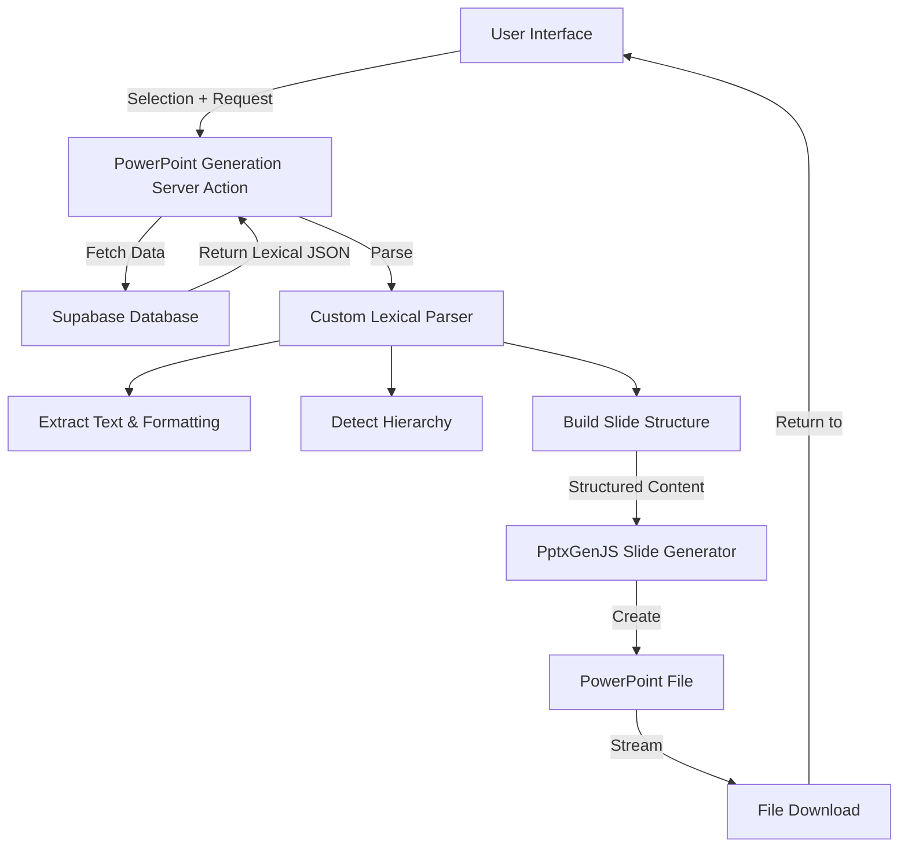

# PowerPoint File Generation System - Design Overview and Implementation Plan

## 1. Introduction

This document outlines the design and implementation plan for a PowerPoint file generation system that will convert Lexical JSON content from the building_blocks_submissions table into downloadable PowerPoint presentations. The system is designed to be extensible, allowing for future enhancements such as chart generation.

## 2. System Architecture Overview

The PowerPoint generation system consists of several key components working together:



### 2.1 Key Components

1. **User Interface**:

   - PowerPoint generation combobox in the AI workspace dashboard
   - Selection of existing presentations
   - Download button and loading states

2. **Server Action**:

   - Authenticated Next.js server action
   - Fetches presentation data from Supabase
   - Coordinates parsing and PowerPoint generation
   - Returns file for download

3. **Lexical JSON Parser**:

   - Extensible processor-based architecture
   - Extracts text, formatting, and structure
   - Detects hierarchy for slide organization
   - Transforms Lexical JSON into structured slide content

4. **PowerPoint Generator**:
   - Uses PptxGenJS library
   - Creates slides based on parsed content
   - Applies formatting and structure
   - Generates downloadable PPTX file

## 3. Extensible Parser Design

The parser is designed with extensibility as a core principle, using a modular architecture that can be expanded to support new content types like charts in the future.

### 3.1 Core Types

```typescript
// Core types that allow for future expansion
type NodeType = 'text' | 'bullet' | 'numbered' | 'image' | 'chart' | 'table'; // Expandable

interface BaseContentItem {
  type: NodeType;
  level?: number;
  formatting?: FormattingOptions;
}

interface TextContentItem extends BaseContentItem {
  type: 'text' | 'bullet' | 'numbered';
  text: string;
}

interface ImageContentItem extends BaseContentItem {
  type: 'image';
  src: string;
  alt?: string;
  width?: number;
  height?: number;
}

// Future chart support
interface ChartContentItem extends BaseContentItem {
  type: 'chart';
  chartType: 'bar' | 'line' | 'pie' | 'scatter';
  data: ChartData;
  options?: ChartOptions;
}

// Union type for all content items
type ContentItem = TextContentItem | ImageContentItem | ChartContentItem; // Expandable

// Slide structure
interface SlideContent {
  title?: string;
  content: ContentItem[];
  layout?: SlideLayout; // For future layout options
}
```

### 3.2 Processor Architecture

The parser uses a processor-based architecture that allows for easy extension:

```typescript
// Processor interface for extensibility
interface NodeProcessor<T extends NodeType> {
  canProcess(node: any): boolean;
  process(node: any, context: ParserContext): ContentItem | null;
}

class LexicalParser {
  private processors: NodeProcessor<NodeType>[] = [];

  // Register new processors to handle different node types
  registerProcessor(processor: NodeProcessor<NodeType>) {
    this.processors.push(processor);
  }

  parse(lexicalJSON: string): SlideContent[] {
    const parsed = JSON.parse(lexicalJSON);
    const slides: SlideContent[] = [];

    // Parse context to share state between processors
    const context: ParserContext = {
      currentSlide: { content: [] },
      slides: slides,
      // other contextual data
    };

    // Process root node and its children
    const rootNode = parsed.root;
    this.processNodes(rootNode.children, context);

    // Add the last slide if it has content
    if (context.currentSlide.content.length > 0) {
      slides.push(context.currentSlide);
    }

    return slides;
  }

  private processNodes(nodes: any[], context: ParserContext) {
    nodes.forEach((node) => {
      // Find a processor that can handle this node
      for (const processor of this.processors) {
        if (processor.canProcess(node)) {
          const result = processor.process(node, context);
          if (result) {
            context.currentSlide.content.push(result);
          }
          break;
        }
      }
    });
  }
}
```

### 3.3 Processor Implementations

```typescript
// Example processor implementations
class TextNodeProcessor implements NodeProcessor<'text'> {
  canProcess(node: any): boolean {
    return node.type === 'paragraph';
  }

  process(node: any, context: ParserContext): ContentItem | null {
    return {
      type: 'text',
      text: this.extractTextFromNode(node),
      formatting: this.extractFormattingFromNode(node),
    };
  }

  private extractTextFromNode(node: any): string {
    // Implementation details
  }

  private extractFormattingFromNode(node: any): FormattingOptions {
    // Implementation details
  }
}

class HeadingNodeProcessor implements NodeProcessor<'text'> {
  canProcess(node: any): boolean {
    return node.type === 'heading';
  }

  process(node: any, context: ParserContext): ContentItem | null {
    // If this is a major heading (h1, h2), create a new slide
    if (node.tag === 'h1' || node.tag === 'h2') {
      // If current slide has content, add it to slides
      if (context.currentSlide.content.length > 0) {
        context.slides.push(context.currentSlide);
      }

      // Create new slide with this heading as title
      context.currentSlide = {
        title: this.extractTextFromNode(node),
        content: [],
      };

      return null; // Already handled by creating a new slide
    }

    // For lower-level headings, add as content
    return {
      type: 'text',
      text: this.extractTextFromNode(node),
      formatting: {
        bold: true,
        fontSize: this.getFontSizeForHeading(node.tag),
      },
    };
  }

  private extractTextFromNode(node: any): string {
    // Implementation details
  }

  private getFontSizeForHeading(tag: string): number {
    // Map heading level to font size
    const sizeMap: Record<string, number> = {
      h1: 32,
      h2: 28,
      h3: 24,
      h4: 20,
      h5: 18,
      h6: 16,
    };

    return sizeMap[tag] || 16;
  }
}

// Future: Chart Node Processor
class ChartNodeProcessor implements NodeProcessor<'chart'> {
  canProcess(node: any): boolean {
    // Check if node contains chart data
    return node.type === 'chartContainer';
  }

  process(node: any, context: ParserContext): ContentItem | null {
    // Extract chart data from the node
    const chartData = this.extractChartData(node);

    return {
      type: 'chart',
      chartType: this.determineChartType(node),
      data: chartData,
      options: this.extractChartOptions(node),
    };
  }

  // Implementation details for chart data extraction
}
```

## 4. PowerPoint Generation with PptxGenJS

The PowerPoint generation component uses PptxGenJS to create slides based on the parsed content:

```typescript
function generatePowerPoint(slideContents: SlideContent[]): pptxgen {
  const pptx = new pptxgen();

  // Set presentation properties
  pptx.layout = 'LAYOUT_16x9';

  // Create slides
  slideContents.forEach((slideContent) => {
    const slide = pptx.addSlide();

    // Add title if present
    if (slideContent.title) {
      slide.addText(slideContent.title, {
        x: 0.5,
        y: 0.5,
        w: '90%',
        h: 1,
        fontSize: 32,
        bold: true,
        color: '363636',
      });
    }

    // Add content
    let yPos = slideContent.title ? 1.5 : 0.5;

    slideContent.content.forEach((item) => {
      switch (item.type) {
        case 'text':
          addTextToSlide(slide, item as TextContentItem, yPos);
          yPos += 0.5;
          break;

        case 'bullet':
        case 'numbered':
          addBulletToSlide(slide, item as TextContentItem, yPos);
          yPos += 0.4;
          break;

        case 'image':
          addImageToSlide(slide, item as ImageContentItem, yPos);
          yPos += 2; // Images typically need more space
          break;

        case 'chart':
          // Future chart support - placeholder for now
          addChartToSlide(slide, item as ChartContentItem, yPos);
          yPos += 3; // Charts typically need more space
          break;
      }
    });
  });

  return pptx;
}

// Helper functions - designed to be extended
function addTextToSlide(slide: any, item: TextContentItem, yPos: number) {
  slide.addText(item.text, {
    x: 0.5,
    y: yPos,
    w: '90%',
    fontSize: 18,
    ...mapFormatting(item.formatting),
  });
}

function addBulletToSlide(slide: any, item: TextContentItem, yPos: number) {
  slide.addText(item.text, {
    x: 0.5 + (item.level || 0) * 0.5,
    y: yPos,
    w: '85%',
    fontSize: 18,
    bullet: {
      type: item.type === 'bullet' ? 'bullet' : 'number',
    },
    ...mapFormatting(item.formatting),
  });
}

// Future support for charts
function addChartToSlide(slide: any, item: ChartContentItem, yPos: number) {
  // Example implementation for future chart support
  const chartData = mapChartData(item.data);

  slide.addChart(
    getChartType(item.chartType), // Map to PptxGenJS chart type
    chartData,
    {
      x: 0.5,
      y: yPos,
      w: '90%',
      h: 3,
      ...mapChartOptions(item.options),
    },
  );
}
```

## 5. Server Action Implementation

The server action handles the PowerPoint generation process:

```typescript
'use server';

import pptxgen from 'pptxgenjs';
import { z } from 'zod';

import { enhanceAction } from '@kit/next/actions';
import { getSupabaseServerClient } from '@kit/supabase/server-client';

// Import our custom parser functions
import {
  generatePowerPoint,
  parseLexicalToSlideContent,
} from '../_lib/pptx-generator';

const GeneratePowerPointSchema = z.object({
  submissionId: z.string().min(1, 'Submission ID is required'),
});

export const generatePowerPointAction = enhanceAction(
  async function (data: z.infer<typeof GeneratePowerPointSchema>, user) {
    try {
      const supabase = getSupabaseServerClient();

      // Fetch the submission data
      const { data: submission, error } = await supabase
        .from('building_blocks_submissions')
        .select('title, outline')
        .eq('id', data.submissionId)
        .single();

      if (error || !submission) {
        throw new Error('Failed to fetch submission data');
      }

      if (!submission.outline) {
        throw new Error('No outline data available for this submission');
      }

      // Parse the Lexical JSON into slide content
      const slideContents = parseLexicalToSlideContent(submission.outline);

      // Generate the PowerPoint
      const pptx = generatePowerPoint(slideContents);

      // Return the PowerPoint as a buffer
      const buffer = await pptx.write('nodebuffer');

      return {
        success: true,
        contentType:
          'application/vnd.openxmlformats-officedocument.presentationml.presentation',
        fileName: `${submission.title || 'Presentation'}.pptx`,
        data: buffer,
      };
    } catch (error) {
      console.error('Error generating PowerPoint:', error);

      return {
        success: false,
        error: error instanceof Error ? error.message : 'Unknown error',
      };
    }
  },
  {
    schema: GeneratePowerPointSchema,
    auth: true,
  },
);
```

## 6. User Interface Implementation

The UI component for PowerPoint generation:

```tsx
'use client';

import { useState } from 'react';

import { useRouter } from 'next/navigation';

import { Download } from 'lucide-react';
import { toast } from 'sonner';

import { Button } from '@kit/ui/button';

import { generatePowerPointAction } from '../_actions/generate-powerpoint';
import { useBuildingBlocksTitles } from '../_lib/hooks/use-building-blocks-titles';
import { Combobox } from './combobox';

export function PowerPointGenerationCombobox() {
  const router = useRouter();
  const { data, isLoading } = useBuildingBlocksTitles();
  const [selectedOutlineId, setSelectedOutlineId] = useState<string>('');
  const [isGenerating, setIsGenerating] = useState(false);

  const presentationOptions =
    data?.data?.map((item: { id: string; title: string }) => ({
      label: item.title,
      value: item.id,
    })) ?? [];

  const handleGeneratePowerPoint = async () => {
    if (!selectedOutlineId) {
      toast.error('Please select an outline first');
      return;
    }

    setIsGenerating(true);

    try {
      const result = await generatePowerPointAction({
        submissionId: selectedOutlineId,
      });

      if (result.success && result.data) {
        // Convert buffer to blob and download
        const blob = new Blob([result.data], {
          type: result.contentType,
        });

        const url = URL.createObjectURL(blob);
        const a = document.createElement('a');
        a.href = url;
        a.download = result.fileName || 'presentation.pptx';
        document.body.appendChild(a);
        a.click();

        setTimeout(() => {
          URL.revokeObjectURL(url);
          document.body.removeChild(a);
        }, 0);

        toast.success('PowerPoint generated successfully');
      } else {
        toast.error(result.error || 'Failed to generate PowerPoint');
      }
    } catch (error) {
      console.error('Error:', error);
      toast.error('An error occurred while generating the PowerPoint');
    } finally {
      setIsGenerating(false);
    }
  };

  return (
    <div className="space-y-2">
      <Combobox
        options={presentationOptions}
        placeholder="Select an outline"
        isLoading={isLoading}
        onSelect={setSelectedOutlineId}
      />

      {selectedOutlineId && (
        <Button
          className="w-full"
          onClick={handleGeneratePowerPoint}
          disabled={isGenerating}
        >
          {isGenerating ? (
            'Generating...'
          ) : (
            <>
              <Download className="mr-2 h-4 w-4" />
              Generate PowerPoint
            </>
          )}
        </Button>
      )}
    </div>
  );
}
```

## 7. Implementation Phases

### Phase 1: Core Infrastructure (2 days)

- Install PptxGenJS package
- Create the extensible parser architecture with processor interfaces
- Implement basic processors for text, bullets, and headings
- Set up the foundation for future processors (chart, table, etc.)

**Deliverables:**

- Basic parser architecture
- Text and heading processors
- Initial PowerPoint generation functionality

### Phase 2: Content Parsing (2-3 days)

- Implement text and formatting processors
- Add support for hierarchical content organization
- Create bullet and numbered list processors
- Implement the slide structure builder

**Deliverables:**

- Complete parser implementation
- Hierarchical content organization
- Formatting preservation

### Phase 3: PowerPoint Generation (2 days)

- Create slide templates and layouts
- Implement content type renderers (text, bullets, etc.)
- Add placeholder functions for future chart rendering
- Create adapter layer between our content model and PptxGenJS

**Deliverables:**

- Functional PowerPoint generation
- Slide templates and layouts
- Content rendering functions

### Phase 4: UI Integration (1-2 days)

- Create PowerPointGenerationCombobox component
- Implement loading states and error handling
- Add download functionality
- Integrate with existing AI workspace dashboard

**Deliverables:**

- UI component for PowerPoint generation
- Loading states and error handling
- File download functionality

### Phase 5: Testing and Future-Proofing (2 days)

- Test with various outline structures
- Ensure proper error handling and user feedback
- Document extension points for future chart support
- Create a roadmap for chart implementation

**Deliverables:**

- Tested and validated system
- Documentation for extension points
- Roadmap for future enhancements

## 8. Extension Points for Future Chart Support

To ensure our system is ready for chart support in the future, we've identified these key extension points:

### 8.1 Chart Data Detection

Future implementation will need to detect potential chart data in Lexical JSON:

1. **Table-based charts**: Recognize tables in Lexical JSON that contain numeric data suitable for charts
2. **Chart node types**: Support for custom chart node types if we extend Lexical
3. **Data markers**: Look for special markers that indicate chart data, such as:
   ```
   [CHART:BAR]
   Category A, 10
   Category B, 20
   Category C, 15
   [/CHART]
   ```

### 8.2 Chart Processor Implementation

The ChartNodeProcessor interface is already defined and can be implemented when chart support is added:

```typescript
class ChartNodeProcessor implements NodeProcessor<'chart'> {
  canProcess(node: any): boolean {
    // Check if node contains chart data
    return node.type === 'chartContainer';
  }

  process(node: any, context: ParserContext): ContentItem | null {
    // Extract chart data from the node
    const chartData = this.extractChartData(node);

    return {
      type: 'chart',
      chartType: this.determineChartType(node),
      data: chartData,
      options: this.extractChartOptions(node),
    };
  }
}
```

### 8.3 Chart Rendering

The PowerPoint generation component already includes a placeholder for chart rendering:

```typescript
function addChartToSlide(slide: any, item: ChartContentItem, yPos: number) {
  // Example implementation for future chart support
  const chartData = mapChartData(item.data);

  slide.addChart(getChartType(item.chartType), chartData, {
    x: 0.5,
    y: yPos,
    w: '90%',
    h: 3,
    ...mapChartOptions(item.options),
  });
}
```

## 9. Conclusion

This implementation plan provides a comprehensive approach to building a PowerPoint file generation system that is both functional for immediate needs and extensible for future enhancements. The modular, processor-based architecture ensures that new content types like charts can be added with minimal changes to the existing codebase.

By following this plan, we will deliver a robust system that allows users to convert their Lexical JSON outlines into professional PowerPoint presentations, enhancing the value of the AI presentation maker functionality.
