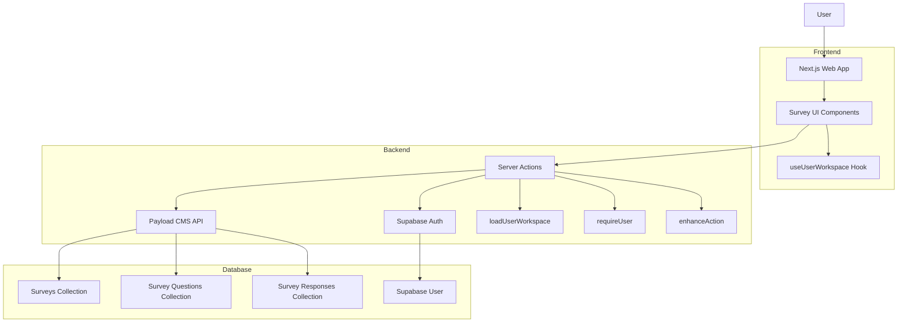

# Survey System Implementation Plan

## Overview

This document outlines the design and implementation plan for a survey system using Payload CMS integrated with the Makerkit/Supabase functionality. The system will allow for creating multiple surveys, tracking user progress, storing responses, and displaying summary results.

## 1. Data Model Design

### Payload CMS Collections

We'll create three new collections in Payload CMS:

#### 1. Surveys Collection

```typescript
{
  slug: 'surveys',
  fields: [
    {
      name: 'title',
      type: 'text',
      required: true
    },
    {
      name: 'slug',
      type: 'text',
      required: true,
      unique: true
    },
    {
      name: 'description',
      type: 'textarea'
    },
    {
      name: 'status',
      type: 'select',
      options: [
        { label: 'Draft', value: 'draft' },
        { label: 'Published', value: 'published' }
      ],
      defaultValue: 'draft'
    },
    {
      name: 'questions',
      type: 'relationship',
      relationTo: 'survey_questions',
      hasMany: true
    },
    {
      name: 'summaryContent',
      type: 'richText',
      editor: lexicalEditor({})
    }
  ]
}
```

#### 2. Survey Questions Collection

```typescript
{
  slug: 'survey_questions',
  fields: [
    {
      name: 'text',
      type: 'text',
      required: true
    },
    {
      name: 'type',
      type: 'select',
      options: [
        { label: 'Multiple Choice', value: 'multiple_choice' }
      ],
      defaultValue: 'multiple_choice'
    },
    {
      name: 'options',
      type: 'array',
      fields: [
        {
          name: 'option',
          type: 'text'
        }
      ]
    },
    {
      name: 'category',
      type: 'text',
      required: true
    },
    {
      name: 'questionspin',
      type: 'select',
      options: [
        { label: 'Positive', value: 'Positive' },
        { label: 'Negative', value: 'Negative' }
      ],
      defaultValue: 'Positive'
    },
    {
      name: 'order',
      type: 'number',
      defaultValue: 0
    }
  ]
}
```

#### 3. Survey Responses Collection

```typescript
{
  slug: 'survey_responses',
  fields: [
    {
      name: 'survey',
      type: 'relationship',
      relationTo: 'surveys',
      required: true
    },
    {
      name: 'userId',
      type: 'text',
      required: true
    },
    {
      name: 'responses',
      type: 'json'
    },
    {
      name: 'categoryScores',
      type: 'json'
    },
    {
      name: 'highestScoringCategory',
      type: 'text'
    },
    {
      name: 'lowestScoringCategory',
      type: 'text'
    },
    {
      name: 'completed',
      type: 'boolean',
      defaultValue: false
    },
    {
      name: 'progress',
      type: 'number',
      defaultValue: 0
    },
    {
      name: 'createdAt',
      type: 'date',
      admin: {
        date: {
          pickerAppearance: 'dayAndTime'
        }
      }
    },
    {
      name: 'updatedAt',
      type: 'date',
      admin: {
        date: {
          pickerAppearance: 'dayAndTime'
        }
      }
    }
  ],
  hooks: {
    beforeChange: [
      ({ data }) => {
        const now = new Date().toISOString();

        if (!data.createdAt) {
          data.createdAt = now;
        }

        data.updatedAt = now;

        return data;
      }
    ]
  }
}
```

### Database Schema

The Payload CMS collections will be stored in the Postgres database in the `payload` schema, as configured in the `payload.config.ts` file. This keeps the Payload data separate from the Makerkit data in the `public` schema.

## 2. User Identification Solution

To identify users from Supabase in our survey system, we'll leverage Makerkit's authentication patterns:

### Server Components

For server components, we'll use the `requireUser` function and `getSupabaseServerClient`:

```typescript
import { redirect } from 'next/navigation';
import { requireUser } from '@kit/supabase/require-user';
import { getSupabaseServerClient } from '@kit/supabase/server-client';

async function SurveyPageServer() {
  const client = getSupabaseServerClient();
  const auth = await requireUser(client);

  // Check if the user needs redirect
  if (auth.error) {
    redirect(auth.redirectTo);
  }

  // User is authenticated
  const user = auth.data;

  // Load survey data
  const surveyData = await fetchSurveyData(surveySlug);

  // Check for existing user response
  const userResponse = await fetchUserSurveyResponse(surveyData.id, user.id);

  return (
    <SurveyComponent
      survey={surveyData}
      initialResponse={userResponse}
      userId={user.id}
    />
  );
}
```

### Client Components

For client components, we'll use the `useUserWorkspace` hook to access user data:

```typescript
'use client';

import { useUserWorkspace } from '@kit/accounts/hooks/use-user-workspace';

export function SurveyClientComponent() {
  const { user, workspace } = useUserWorkspace();

  // Now we have access to the user data
  // user.id can be used to identify the user

  return (
    // Survey UI components
  );
}
```

### Server Actions

For server actions that handle survey responses, we'll use:

```typescript
'use server';

import { redirect } from 'next/navigation';

import { z } from 'zod';

import { enhanceAction } from '@kit/next/actions';
import { requireUser } from '@kit/supabase/require-user';
import { getSupabaseServerClient } from '@kit/supabase/server-client';

const SaveResponseSchema = z.object({
  surveyId: z.string(),
  questionId: z.string(),
  response: z.string(),
  category: z.string(),
});

export const saveResponseAction = enhanceAction(
  async function (data, user) {
    // data is already validated against SaveResponseSchema
    // user is the authenticated user from Supabase

    // Save the response to Payload CMS
    const response = await saveResponseToPayload(
      data.surveyId,
      user.id,
      data.questionId,
      data.response,
      data.category,
    );

    return { success: true, response };
  },
  {
    auth: true, // Require authentication
    schema: SaveResponseSchema,
  },
);
```

## 3. User Progress Tracking Solution

To track user progress through surveys:

1. We'll create a `progress` field in the survey response that tracks the percentage of questions completed.
2. Each time a user answers a question, we'll update the progress:

```typescript
const progress = (answeredQuestions.length / totalQuestions) * 100;
```

3. We'll store the current question index in the survey response to allow users to resume where they left off.
4. When a user returns to a survey, we'll check if they have an existing response and load their progress.

## 4. Frontend Implementation

### Integration with User Workspace

Since our survey system will be part of the user workspace (`/home/(user)/assessment`), we'll leverage the `loadUserWorkspace` function to access user data in server components:

```typescript
import { loadUserWorkspace } from '~/home/(user)/_lib/server/load-user-workspace';

export default async function AssessmentPage() {
  const { user, workspace } = await loadUserWorkspace();

  // Now we have access to:
  // - user: The Supabase Auth user object
  // - workspace: The user's personal account

  // Load survey data
  const surveyData = await fetchSurveyData('assessment');

  return (
    <SurveyComponent
      survey={surveyData}
      userId={user.id}
      userName={user.user_metadata.full_name}
    />
  );
}
```

### Component Structure

1. **AssessmentPage (Server Component)**

   - Uses `loadUserWorkspace` to get user data
   - Fetches survey data from Payload CMS
   - Passes data to client components

2. **SurveyContainer (Client Component)**

   - Uses `useUserWorkspace` hook for client-side user data
   - Manages survey state and navigation
   - Renders appropriate sub-components based on survey progress

3. **SurveyQuestion (Client Component)**

   - Renders individual questions
   - Handles user responses
   - Uses server actions to save responses

4. **SurveySummary (Client Component)**
   - Displays survey results and visualizations
   - Shows personalized feedback based on responses

### Survey Page Structure

1. **Survey Introduction Page**

   - Display survey title and description
   - "Start Survey" button

2. **Survey Questions Page**

   - Question text
   - Multiple choice options
   - Progress indicator
   - Next/Previous buttons

3. **Survey Summary Page**
   - Display category scores
   - Show highest and lowest scoring categories
   - Radar chart visualization
   - Option to retake survey

### State Management

We'll use React Query for data fetching and state management:

```typescript
const { data: survey, isLoading } = useQuery({
  queryKey: ['survey', surveySlug],
  queryFn: () => fetchSurvey(surveySlug),
});

const { data: userResponse, isLoading: isLoadingResponse } = useQuery({
  queryKey: ['surveyResponse', surveyId, userId],
  queryFn: () => fetchUserSurveyResponse(surveyId, userId),
});
```

## 5. API Implementation

### Server Actions for Survey System

We'll use Makerkit's `enhanceAction` pattern for all server actions:

```typescript
'use server';

import { z } from 'zod';

import { enhanceAction } from '@kit/next/actions';

// Schema for fetching a survey
const GetSurveySchema = z.object({
  slug: z.string(),
});

// Action to fetch a survey
export const getSurveyAction = enhanceAction(
  async function (data, user) {
    // Create Payload CMS client
    const client = await createPayloadClient();

    // Fetch survey data
    const survey = await client.getContentItemBySlug({
      slug: data.slug,
      collection: 'surveys',
    });

    return { survey };
  },
  {
    auth: true,
    schema: GetSurveySchema,
  },
);

// Schema for saving a survey response
const SaveSurveyResponseSchema = z.object({
  surveyId: z.string(),
  responses: z.array(
    z.object({
      questionId: z.string(),
      response: z.string(),
      score: z.number(),
      category: z.string(),
    }),
  ),
  progress: z.number(),
  completed: z.boolean(),
  categoryScores: z.record(z.string(), z.number()).optional(),
  highestScoringCategory: z.string().optional(),
  lowestScoringCategory: z.string().optional(),
});

// Action to save a survey response
export const saveSurveyResponseAction = enhanceAction(
  async function (data, user) {
    // Implementation to save response to Payload CMS
    // ...

    return { success: true };
  },
  {
    auth: true,
    schema: SaveSurveyResponseSchema,
  },
);
```

### API Routes

For any necessary API routes, we'll use Makerkit's `enhanceRouteHandler`:

```typescript
import { NextResponse } from 'next/server';

import { z } from 'zod';

import { enhanceRouteHandler } from '@kit/next/routes';

const SurveyResponseSchema = z.object({
  surveyId: z.string(),
  // other fields...
});

export const POST = enhanceRouteHandler(
  async function ({ body, user, request }) {
    // body is already validated against SurveyResponseSchema
    // user is the authenticated user

    // Implementation to save response to Payload CMS
    // ...

    return NextResponse.json({
      success: true,
    });
  },
  {
    schema: SurveyResponseSchema,
    auth: true,
  },
);
```

## 6. Integration Plan

1. Create the Payload CMS collections
2. Implement the API routes for survey data
3. Create the frontend components
4. Implement the state management and data fetching
5. Add the survey to the assessment page
6. Test the full flow

## 7. Implementation Timeline

1. **Day 1**: Set up Payload CMS collections and basic API routes
2. **Day 2**: Implement frontend components and state management
3. **Day 3**: Integrate with Supabase authentication and test

## 8. System Architecture



## 9. Survey Flow

```mermaid
sequenceDiagram
    participant User
    participant UI as Survey UI
    participant Workspace as User Workspace API
    participant Actions as Server Actions
    participant Auth as Supabase Auth
    participant CMS as Payload CMS
    participant DB as Database

    User->>UI: Access Assessment Page
    UI->>Workspace: loadUserWorkspace()
    Workspace->>Auth: Get User Data
    Auth-->>Workspace: User Data
    Workspace-->>UI: User & Workspace Data
    UI->>Actions: getSurveyAction()
    Actions->>Auth: Verify User (enhanceAction)
    Auth-->>Actions: User Data
    Actions->>CMS: Fetch Survey
    CMS-->>Actions: Survey Data
    Actions->>CMS: Check Existing Response
    CMS-->>Actions: Response Data (if exists)
    Actions-->>UI: Survey + Response Data
    UI->>User: Display Survey

    User->>UI: Answer Question
    UI->>Actions: saveResponseAction()
    Actions->>Auth: Verify User (enhanceAction)
    Auth-->>Actions: User Data
    Actions->>CMS: Update Response
    CMS-->>Actions: Confirmation
    Actions-->>UI: Updated Progress

    User->>UI: Complete Survey
    UI->>Actions: completeSurveyAction()
    Actions->>Auth: Verify User (enhanceAction)
    Auth-->>Actions: User Data
    Actions->>CMS: Calculate Scores
    Actions->>CMS: Mark as Complete
    CMS-->>Actions: Confirmation
    Actions-->>UI: Survey Results
    UI->>User: Display Summary
```



## 10. Next Steps

1. Create the Payload CMS collections for surveys, questions, and responses
2. Implement the server actions for fetching and saving survey data
3. Create the frontend components for the survey system
4. Integrate with the assessment page
5. Test the full flow with real users
